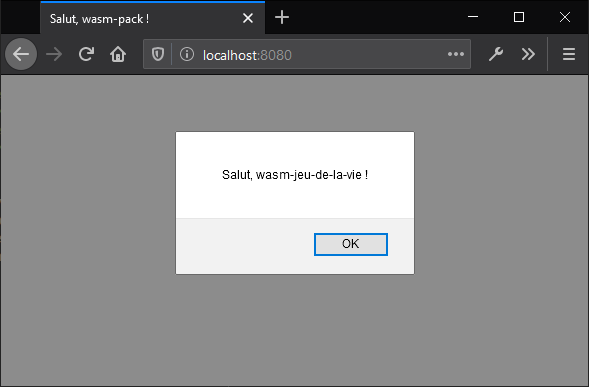

> # 🚧 Attention, peinture fraîche !
>
> Cette page a été traduite par une seule personne et n'a pas été relue et
> vérifiée par quelqu'un d'autre ! Les informations peuvent par exemple être
> erronées, être formulées maladroitement, ou contenir d'autres types de fautes.

<!--
# Hello, World!
-->

# Hello, World !

<!--
This section will show you how to build and run your first Rust and WebAssembly
program: a Web page that alerts "Hello, World!"
-->

Cette section va vous expliquer comment compiler et exécuter votre premier
programme en Rust et WebAssembly : une page web qui affiche une boite de
dialogue "Hello, World !".

<!--
Make sure you have followed the [setup instructions](setup.html) before beginning.
-->

Assurez-vous que vous avez suivi les [réglages](setup.html) avant de commencer.

<!--
## Clone the Project Template
-->

## Cloner le modèle de projet

<!--
The project template comes pre-configured with sane defaults, so you can quickly
build, integrate, and package your code for the Web.
-->

Le modèle de projet est livré avec des réglages préconfigurés par défaut avec
des valeurs stables, afin que vous puissiez compiler, intégrer et créer un
paquet pour le Web.

<!--
Clone the project template with this command:
-->

Vous pouvez cloner le modèle du projet avec cette commande :

<!--
```text
cargo generate --git https://github.com/rustwasm/wasm-pack-template
```
-->

```text
cargo generate --git https://github.com/Jimskapt/wasm-pack-template-fr
```

*(la version anglaise originale du modèle est aussi disponible à l'adresse
[https://github.com/rustwasm/wasm-pack-template](https://github.com/rustwasm/wasm-pack-template))*

<!--
This should prompt you for the new project's name. We will use
**"wasm-game-of-life"**.
-->

Elle devrait vous demander le nom du nouveau projet. Nous allons y renseigner
**"wasm-jeu-de-la-vie"**.

<!--
```text
wasm-game-of-life
```
-->

```text
wasm-jeu-de-la-vie
```

<!--
## What's Inside
-->

## Qu'est-ce qui est livré ?

<!--
Enter the new `wasm-game-of-life` project
-->

Entrez dans le dossier `wasm-jeu-de-la-vie` du nouveau projet ...

<!--
```
cd wasm-game-of-life
```
-->

```
cd wasm-jeu-de-la-vie
```

<!--
and let's take a look at its contents:
-->

... et regardez son contenu :

<!--
```text
wasm-game-of-life/
├── Cargo.toml
├── LICENSE_APACHE
├── LICENSE_MIT
├── README.md
└── src
    ├── lib.rs
    └── utils.rs
```
-->

```text
wasm-jeu-de-la-vie/
├── Cargo.toml
├── LICENSE_APACHE
├── LICENSE_MIT
├── README.md
└── src
    ├── lib.rs
    └── utils.rs
```

<!--
Let's take a look at a couple of these files in detail.
-->

Maintenant, analysons en détail le contenu de certains de ces fichiers.

<!--
### `wasm-game-of-life/Cargo.toml`
-->

### `wasm-jeu-de-la-vie/Cargo.toml`

<!--
The `Cargo.toml` file specifies dependencies and metadata for `cargo`, Rust's
package manager and build tool. This one comes pre-configured with a
`wasm-bindgen` dependency, a few optional dependencies we will dig into later,
and the `crate-type` properly initialized for generating `.wasm` libraries.
-->

Le fichier `Cargo.toml` renseigne les dépendances et les métadonnées pour
`cargo`, le gestionnaire de paquets et outil de compilation de Rust. Ce fichier
est préconfiguré avec une dépendance à `wasm-bindgen`, quelques dépendances
optionnelles que nous verrons plus tard, ainsi que la propriété `crate-type`
bien réglé pour générer des bibliothèques en `.wasm`.

<!--
### `wasm-game-of-life/src/lib.rs`
-->

### `wasm-jeu-de-la-vie/src/lib.rs`

<!--
The `src/lib.rs` file is the root of the Rust crate that we are compiling to
WebAssembly. It uses `wasm-bindgen` to interface with JavaScript. It imports the
`window.alert` JavaScript function, and exports the `greet` Rust function, which
alerts a greeting message.
-->

Le fichier `src/lib.rs` est la racine de la crate Rust que nous compilerons en
WebAssembly. Il utilise `wasm-bindgen` pour s'interfacer avec JavaScript. Il
importe la fonction JavaScript `window.alert`, et exporte la fonction Rust
`saluer`, qui affiche un message de salutation.

<!--
```rust
mod utils;

use wasm_bindgen::prelude::*;

// When the `wee_alloc` feature is enabled, use `wee_alloc` as the global
// allocator.
#[cfg(feature = "wee_alloc")]
#[global_allocator]
static ALLOC: wee_alloc::WeeAlloc = wee_alloc::WeeAlloc::INIT;

#[wasm_bindgen]
extern {
    fn alert(s: &str);
}

#[wasm_bindgen]
pub fn greet() {
    alert("Hello, wasm-game-of-life!");
}
```
-->

```rust
mod utils;

use wasm_bindgen::prelude::*;

// Lorsque la fonctionnalité `wee_alloc` est activée, nous allons utiliser
// `wee_alloc` en tant qu'allocateur global.
#[cfg(feature = "wee_alloc")]
#[global_allocator]
static ALLOC: wee_alloc::WeeAlloc = wee_alloc::WeeAlloc::INIT;

#[wasm_bindgen]
extern {
    fn alert(s: &str);
}

#[wasm_bindgen]
pub fn saluer() {
    alert("Salut, wasm-jeu-de-la-vie !");
}
```

<!--
### `wasm-game-of-life/src/utils.rs`
-->

### `wasm-jeu-de-la-vie/src/utils.rs`

<!--
The `src/utils.rs` module provides common utilities to make working with Rust
compiled to WebAssembly easier. We will take a look at some of these utilities
in more detail later in the tutorial, such as when we look at [debugging our wasm
code](debugging.html), but we can ignore this file for now.
-->

Le module `src/utils.rs` fournit quelques outils communs pour faciliter la
compilation de Rust en WebAssembly. Nous nous discuterons en détails de ces
outils plus tard dans le tutoriel, en particulier lorsque nous demanderons
comment [déboguer notre code wasm](debugging.html), mais pour l'instant nous
pouvons nous contenter d'ignorer ce fichier.

<!--
## Build the Project
-->

## Compiler le projet

<!--
We use `wasm-pack` to orchestrate the following build steps:
-->

Nous allons utiliser `wasm-pack` pour orchestrer les étapes de compilation
suivantes :

<!--
* Ensure that we have Rust 1.30 or newer and the `wasm32-unknown-unknown`
  target installed via `rustup`,
* Compile our Rust sources into a WebAssembly `.wasm` binary via `cargo`,
* Use `wasm-bindgen` to generate the JavaScript API for using our Rust-generated
  WebAssembly.
-->

* S'assurer que nous avons Rust 1.30 ou plus récent et la cible
  `wasm32-unknown-unknown` via `rustup`,
* Compiler nos sources Rust en binaires WebAssembly `.wasm` via `cargo`,
* Utiliser `wasm-bindgen` pour générer l'API JavaScript pour utiliser notre
  WebAssembly généré par Rust.

<!--
To do all of that, run this command inside the project directory:
-->

Pour faire tout cela, lancez cette commande dans le dossier du projet :

```
wasm-pack build
```

<!--
When the build has completed, we can find its artifacts in the `pkg` directory,
and it should have these contents:
-->

Lorsque la compilation sera achevée, nous pourrons trouver ses artefacts dans le
dossier `pkg`, et il devrait avoir ce contenu :

<!--
```
pkg/
├── package.json
├── README.md
├── wasm_game_of_life_bg.wasm
├── wasm_game_of_life.d.ts
└── wasm_game_of_life.js
```
-->

```
pkg/
├── package.json
├── README.md
├── wasm_jeu_de_la_vie_bg.wasm
├── wasm_jeu_de_la_vie.d.ts
└── wasm_jeu_de_la_vie.js
```

<!--
The `README.md` file is copied from the main project, but the others are
completely new.
-->

Le fichier `README.md` est copié à partir de la racine du projet, mais les
autres sont complètement nouveaux.

<!--
### `wasm-game-of-life/pkg/wasm_game_of_life_bg.wasm`
-->

### `wasm-jeu-de-la-vie/pkg/wasm_jeu_de_la_vie_bg.wasm`

<!--
The `.wasm` file is the WebAssembly binary that is generated by the Rust
compiler from our Rust sources. It contains the compiled-to-wasm versions of all
of our Rust functions and data. For example, it has an exported "greet"
function.
-->

Le fichier `.wasm` est le binaire WebAssembly qui est généré par le compilateur
Rust à partir de nos sources Rust. Il contient les formes compilées en wasm de
toutes nos fonctions et nos données. Par exemple, il a une fonction exportée
`saluer`.

<!--
### `wasm-game-of-life/pkg/wasm_game_of_life.js`
-->

### `wasm-jeu-de-la-vie/pkg/wasm-jeu-de-la-vie.js`

<!--
The `.js` file is generated by `wasm-bindgen` and contains JavaScript glue for
importing DOM and JavaScript functions into Rust and exposing a nice API to the
WebAssembly functions to JavaScript. For example, there is a JavaScript `greet`
function that wraps the `greet` function exported from the WebAssembly
module. Right now, this glue isn't doing much, but when we start passing more
interesting values back and forth between wasm and JavaScript, it will help
shepherd those values across the boundary.
-->

Le fichier `.js` est généré par `wasm-bindgen` et contient la glu en JavaScript
pour importer le DOM et les fonctions JavaScript dans Rust et exposer une API
conviviale aux fonctions en WebAssembly à destination du JavaScript. Par
exemple, il existe une fonction JavaScript `saluer` qui englobe la fonction
`saluer` exportée du module en WebAssembly. Pour le moment, cette glu ne fait
pas grand-chose, mais lorsque nous commencerons à y envoyer des valeurs plus
intéressantes qui vont et viennent entre wasm et JavaScript, cela facilitera le
passage de l'un à l'autre côté.

<!--
```js
import * as wasm from './wasm_game_of_life_bg';

// ...

export function greet() {
    return wasm.greet();
}
```
-->

```js
import * as wasm from './wasm_jeu_de_la_vie_bg';

// ...

export function saluer() {
    return wasm.saluer();
}
```

<!--
### `wasm-game-of-life/pkg/wasm_game_of_life.d.ts`
-->

### `wasm-jeu-de-la-vie/pkg/wasm_jeu_de_la_vie.d.ts`

<!--
The `.d.ts` file contains [TypeScript][] type declarations for the JavaScript
glue. If you are using TypeScript, you can have your calls into WebAssembly
functions type checked, and your IDE can provide autocompletions and
suggestions! If you aren't using TypeScript, you can safely ignore this file.
-->

Le fichier `.d.ts` contient des déclarations de type [TypeScript][] pour la glu
JavaScript. Si vous utilisez TypeScript, vous pourrez faire en sorte que les
appels aux fonctions en WebAssembly vérifient les types, et votre IDE pourra
vous proposer de l'autocompletion et des suggestions ! Si vous n'utilisez pas le
TypeScript, vous pouvez ignorer ce fichier sans problème.

<!--
```typescript
export function greet(): void;
```
-->

```typescript
export function saluer(): void;
```

[TypeScript]: http://www.typescriptlang.org/

<!--
### `wasm-game-of-life/pkg/package.json`
-->

### `wasm-jeu-de-la-vie/pkg/package.json`

<!--
[The `package.json` file contains metadata about the generated JavaScript and
WebAssembly package.][package.json] This is used by npm and JavaScript bundlers
to determine dependencies across packages, package names, versions, and a bunch
of other stuff. It helps us integrate with JavaScript tooling and allows us to
publish our package to npm.
-->

[Le fichier `package.json` contient des métadonnées sur le paquet généré en
JavaScript et en WebAssembly][package.json]. Il est utilisé par npm et les
packageurs JavaScript pour décrire les dépendances entre les paquets, les noms
de ces paquets, leurs versions, et un tas d'autres choses. Il nous aide à nous
intégrer avec les outils JavaScript et nous permet de publier notre paquet sur
npm.

<!--
```json
{
  "name": "wasm-game-of-life",
  "collaborators": [
    "Your Name <your.email@example.com>"
  ],
  "description": null,
  "version": "0.1.0",
  "license": null,
  "repository": null,
  "files": [
    "wasm_game_of_life_bg.wasm",
    "wasm_game_of_life.d.ts"
  ],
  "main": "wasm_game_of_life.js",
  "types": "wasm_game_of_life.d.ts"
}
```
-->

```json
{
  "name": "wasm-jeu-de-la-vie",
  "collaborators": [
    "Votre nom <votre.email@exemple.com>"
  ],
  "description": null,
  "version": "0.1.0",
  "license": null,
  "repository": null,
  "files": [
    "wasm_jeu_de_la_vie_bg.wasm",
    "wasm_jeu_de_la_vie.d.ts"
  ],
  "main": "wasm_jeu_de_la_vie.js",
  "types": "wasm_jeu_de_la_vie.d.ts"
}
```

[package.json]: https://docs.npmjs.com/files/package.json

<!--
## Putting it into a Web Page
-->

## Tout intégrer dans une page web

<!--
To take our `wasm-game-of-life` package and use it in a Web page, we use [the
`create-wasm-app` JavaScript project template][create-wasm-app].
-->

Pour intégrer notre paquet `wasm-jeu-de-la-vie` dans une page Web et l'utiliser,
nous avons avoir recours au [modèle de projet JavaScript
`create-wasm-app-fr`](https://github.com/Jimskapt/create-wasm-app-fr).

<!--
[create-wasm-app]: https://github.com/rustwasm/create-wasm-app
-->

<!--
Run this command within the `wasm-game-of-life` directory:
-->

Lancez ensuite la commande suivante dans le dossier `wasm-jeu-de-la-vie` :

<!--
```
npm init wasm-app www
```
-->

```
npm init wasm-app-fr www
```

ou, pour sa version anglaise :

```
npm init wasm-app www
```

<!--
Here's what our new `wasm-game-of-life/www` subdirectory contains:
-->

Maintenant, notre nouveau sous-dossier `wasm-jeu-de-la-vie/www` contient :

<!--
```
wasm-game-of-life/www/
├── bootstrap.js
├── index.html
├── index.js
├── LICENSE-APACHE
├── LICENSE-MIT
├── package.json
├── README.md
└── webpack.config.js
```
-->

```
wasm-jeu-de-la-vie/www/
├── bootstrap.js
├── index.html
├── index.js
├── LICENSE-APACHE
├── LICENSE-MIT
├── package.json
├── README.md
└── webpack.config.js
```

<!--
Once again, let's take a closer look at some of these files.
-->

A nouveau, regardons certains de ces fichiers.

<!--
### `wasm-game-of-life/www/package.json`
-->

### `wasm-jeu-de-la-vie/www/package.json`

<!--
This `package.json` comes pre-configured with `webpack` and `webpack-dev-server`
dependencies, as well as a dependency on `hello-wasm-pack`, which is a version
of the initial `wasm-pack-template` package that has been published to npm.
-->

Ce `package.json` est préconfiguré avec les dépendances `webpack` et
`webpack-dev-server`, ainsi qu'une dépendance à `salut-wasm-pack`, qui est une
version du paquet initial `wasm-pack-template` qui a été publié sur npm.

<!--
### `wasm-game-of-life/www/webpack.config.js`
-->

### `wasm-jeu-de-la-vie/www/webpack.config.js`

<!--
This file configures webpack and its local development server. It comes
pre-configured, and you shouldn't have to tweak this at all to get webpack and
its local development server working.
-->

Ce fichier configure webpack et son serveur de développement local. Il est
préconfiguré pour que vous n'ayez pas à y toucher pour que webpack et son
serveur de développement local fonctionnent correctement.

<!--
### `wasm-game-of-life/www/index.html`
-->

### `wasm-jeu-de-la-vie/www/index.html`

<!--
This is the root HTML file for the Web page. It doesn't do much other than
load `bootstrap.js`, which is a very thin wrapper around `index.js`.
-->

C'est le fichier HTML racine de notre page Web. Elle ne fait pas grand-chose
d'autre que de charger `bootstrap.js`, qui est une petite enveloppe autour de
`index.js`.

<!--
```html
<!DOCTYPE html>
<html>
  <head>
    <meta charset="utf-8">
    <title>Hello wasm-pack!</title>
  </head>
  <body>
    <script src="./bootstrap.js"></script>
  </body>
</html>
```
-->

```html
<!DOCTYPE html>
<html>
  <head>
    <meta charset="utf-8">
    <title>Salut, wasm-pack !</title>
  </head>
  <body>
    <noscript>Cette page utilise du webassembly et du javascript, veuillez activer le javascript dans votre navigateur.</noscript>
    <script src="./bootstrap.js"></script>
  </body>
</html>
```

<!--
### `wasm-game-of-life/www/index.js`
-->

### `wasm-jeu-de-la-vie/www/index.js`

<!--
The `index.js` is the main entry point for our Web page's JavaScript. It imports
the `hello-wasm-pack` npm package, which contains the default
`wasm-pack-template`'s compiled WebAssembly and JavaScript glue, then it calls
`hello-wasm-pack`'s `greet` function.
-->

Le fichier `index.js` est le point d'entrée central du JavaScript de notre page
Web. Il importe le paquet npm `salut-wasm-pack`, qui contient la glu
WebAssembly et JavaScript précompilée de `wasm-pack-template`, et qui ensuite
appelle la fonction `saluer` de `salut-wasm-pack`.

<!--
```js
import * as wasm from "hello-wasm-pack";

wasm.greet();
```
-->

```js
import * as wasm from "salut-wasm-pack";

wasm.saluer();
```

<!--
### Install the dependencies
-->

### Installer les dépendances

<!--
First, ensure that the local development server and its dependencies are
installed by running `npm install` within the `wasm-game-of-life/www`
subdirectory:
-->

D'abord, il va falloir s'assurer que le serveur de développement local et ses
dépendances sont installées en lançant `npm install` dans le sous-dossier
`wasm-jeu-de-la-vie/www` :

```text
npm install
```

<!--
This command only needs to be run once, and will install the `webpack`
JavaScript bundler and its development server.
-->

Cette commande n'a besoin d'être exécutée une seule fois, et va installer le
packageur JavaScript `webpack` et son serveur de développement. 

<!--
> Note that `webpack` is not required for working with Rust and WebAssembly, it
> is just the bundler and development server we've chosen for convenience
> here. Parcel and Rollup should also support importing WebAssembly as
> ECMAScript modules. You can also use Rust and WebAssembly [without a
> bundler][] if you prefer!
-->

> Notez que `webpack` n'est pas nécessaire pour travailler Rust et WebAssembly,
> c'est juste le packageur et le serveur de développement que nous avons choisi
> par confort ici. Parcel et Rollup devraient aussi implémenter l'import de
> WebAssembly en tant que module ECMAScript. Vous pouvez aussi utiliser Rust et
> WebAssembly [sans packageur][without a bundler] si vous le préférez !

[without a bundler]: https://rustwasm.github.io/docs/wasm-bindgen/examples/without-a-bundler.html

<!--
### Using our Local `wasm-game-of-life` Package in `www`
-->

### Utiliser notre paquet local `wasm-jeu-de-la-vie` dans `www`

<!--
Rather than use the `hello-wasm-pack` package from npm, we want to use our local
`wasm-game-of-life` package instead. This will allow us to incrementally develop
our Game of Life program.
-->

Plutôt que d'utiliser le paquet `hello-wasm-pack` provenant de npm, nous voulons
utiliser notre paquet local `wasm-jeu-de-la-vie`. Cela va nous permettre de
développer de manière incrémentale notre programme de "Jeu de la vie".

<!--
Open up `wasm-game-of-life/www/package.json` and next to `"devDependencies"`, add the `"dependencies"` field,
including a `"wasm-game-of-life": "file:../pkg"` entry:
-->

Ouvrez `wasm-jeu-de-la-vie/www/package.json` et à côté de `"devDependencies"`,
ajoutez le champ `"dependencies"`, et ajoutez-lui l'entrée
`"wasm-jeu-de-la-vie": "file:../pkg"` :

<!--
```js
{
  // ...
  "dependencies": {                     // Add this three lines block!
    "wasm-game-of-life": "file:../pkg"
  },
  "devDependencies": {
    //...
  }
}
```
-->

```js
{
  // ...
  "dependencies": {                     // Ajoutez ce bloc de trois lignes !
    "wasm-jeu-de-la-vie": "file:../pkg"
  },
  "devDependencies": {
    //...
  }
}
```

<!--
Next, modify `wasm-game-of-life/www/index.js` to import `wasm-game-of-life`
instead of the `hello-wasm-pack` package:
-->

Ensuite, modifiez `wasm-jeu-de-la-vie/www/index.js` pour importer
`wasm-jeu-de-la-vie` à la place du paquet `salut-wasm-pack` :

<!--
```js
import * as wasm from "wasm-game-of-life";

wasm.greet();
```
-->

```js
import * as wasm from "wasm-jeu-de-la-vie";

wasm.saluer();
```

<!--
Since we declared a new dependency, we need to install it:
```text
npm install
```
-->

Comme nous avons déclaré une nouvelle dépendance, nous devons l'installer :

```text
npm install
```

<!--
Our Web page is now ready to be served locally!
-->

Notre page web est maintenant prête à être servie localement !

<!--
## Serving Locally
-->

## Servir localement

<!--
Next, open a new terminal for the development server. Running the server in a
new terminal lets us leave it running in the background, and doesn't block us
from running other commands in the meantime. In the new terminal, run this
command from within the `wasm-game-of-life/www` directory:
-->

Maintenant, ouvrez un nouveau terminal pour le serveur de développement.
Exécuter le serveur dans un nouveau terminal nous permet de l'exécuter en
arrière-plan, et ainsi ne nous empêche pas de lancer d'autres commandes en même
temps. Dans le nouveau terminal, lancez cette commande dans le dossier
`wasm-jeu-de-la-vie/www` :

```
npm run start
```

<!--
Navigate your Web browser to [http://localhost:8080/](http://localhost:8080/)
and you should be greeted with an alert message:
-->

Rendez-vous à l'adresse [http://localhost:8080/](http://localhost:8080/) avec
votre navigateur web et vous devriez être accueilli par un message
d'avertissement :

<!--
[](../images/game-of-life/hello-world.png)
-->

[](images/game-of-life/hello-world.png)

<!--
Anytime you make changes and want them reflected on
[http://localhost:8080/](http://localhost:8080/), just re-run the `wasm-pack
build` command within the `wasm-game-of-life` directory.
-->

A chaque fois que vous allez faire des changements dans le code Rust et que vous
souhaitez les intégrer dans [http://localhost:8080/](http://localhost:8080/),
relancez simplement la commande `wasm-pack build` dans le dossier
`wasm-jeu-de-la-vie`.

<!--
## Exercises
-->

## Exercice

<!--
* Modify the `greet` function in `wasm-game-of-life/src/lib.rs` to take a `name:
  &str` parameter that customizes the alerted message, and pass your name to the
  `greet` function from inside `wasm-game-of-life/www/index.js`. Rebuild the
  `.wasm` binary with `wasm-pack build`, then refresh
  [http://localhost:8080/](http://localhost:8080/) in your Web browser and you
  should see a customized greeting!
-->

* Essayez de modifier la fonction `saluer` dans `wasm-jeu-de-la-vie/src/lib.rs`
  pour prendre en paramètre un `nom: &str` qui personnalise le message d'alerte,
  et passez votre nom à la fonction `saluer` à l'intérieur de
  `wasm-jeu-de-la-vie/www/index.js`. Recompilez le binaire `.wasm` avec
  `wasm-pack build`, et ensuite rafraîchissez
  [http://localhost:8080/](http://localhost:8080/) dans votre navigateur web, et
  vous devrez voir une salutation personnalisée !

<!--
  <details>
    <summary>Answer</summary>

    New version of the `greet` function in `wasm-game-of-life/src/lib.rs`:

    ```rust
    #[wasm_bindgen]
    pub fn greet(name: &str) {
        alert(&format!("Hello, {}!", name));
    }
    ```

    New invocation of `greet` in `wasm-game-of-life/www/index.js`:

    ```js
    wasm.greet("Your Name");
    ```

  </details>
-->

<details>
  <summary>Réponse</summary>

  Nouvelle version de la fonction `saluer` dans `wasm-jeu-de-la-vie/src/lib.rs`:

  ```rust
  #[wasm_bindgen]
  pub fn saluer(nom: &str) {
      alert(&format!("Salut, {} !", nom));
  }
  ```

  Nouvelle utilisation de `saluer` dans `wasm-jeu-de-la-vie/www/index.js`:

  ```js
  wasm.saluer("votre nom");
  ```

</details>
