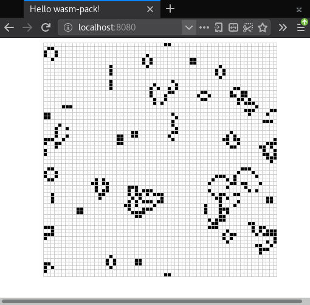

> # 🚧 Attention, peinture fraîche !
>
> Cette page a été traduite par une seule personne et n'a pas été relue et
> vérifiée par quelqu'un d'autre ! Les informations peuvent par exemple être
> erronées, être formulées maladroitement, ou contenir d'autres types de fautes.

<!--
# Implementing Conway's Game of Life
-->

# Implémenter le jeu de la vie de Conway

<!--
## Design
-->

## Conception

<!--
Before we dive in, we have some design choices to consider.
-->

Avant de nous plonger dans le sujet, nous devons prendre en considération
quelques choix de conception.

<!--
### Infinite Universe
-->

### Un univers infini

<!--
The Game of Life is played in an infinite universe, but we do not have infinite
memory and compute power. Working around this rather annoying limitation usually
comes in one of three flavors:
-->

Le jeu de la vie se déroule dans un univers infini, mais nous n'avons pas une
mémoire et une puissance de calcul infinie. Pour contourner cette limitation
plutôt ennuyeuse, il a généralement trois possibilités :

<!--
1. Keep track of which subset of the universe has interesting things happening,
   and expand this region as needed. In the worst case, this expansion is
   unbounded and the implementation will get slower and slower and eventually
   run out of memory.
-->

1. Identifier dans quel sous-ensemble de l'univers il se passe des choses
   intéressantes, et agrandir cette zone si nécessaire. Dans le pire des cas,
   cette expansion se fera sans limites et donc la simulation deviendra de plus
   en plus lent et arrivera à cours de mémoire.

<!--
2. Create a fixed-size universe, where cells on the edges have fewer neighbors
   than cells in the middle. The downside with this approach is that infinite
   patterns, like gliders, that reach the end of the universe are snuffed out.
-->

2. Créer un univers à taille fixe, dans lequel les cellules sur ses bords auront
   moins de voisines que les cellules au centre. Le désavantage de cette
   approche est que les schémas infinis, comme les planeurs, qui atteignent
   probablement la fin de l'univers, seront éliminés.

<!--
3. Create a fixed-size, periodic universe, where cells on the edges have
   neighbors that wrap around to the other side of the universe. Because
   neighbors wrap around the edges of the universe, gliders can keep running
   forever.
-->

3. Créer un univers à taille fixe, mais en boucle, où les cellules sur les bords
   seront directement voisines de celles qui sont de l'autre côté de l'univers.
   Comme les voisines de recoupent d'un bout à l'autre de l'univers, les
   planeurs pourront continuer à vivre à l'infini.

<!--
We will implement the third option.
-->

Nous allons implémenter la troisième option.

<!--
### Interfacing Rust and JavaScript
-->

### Interfacer Rust et le JavaScript

<!--
> ⚡ This is one of the most important concepts to understand and take away from
> this tutorial!
-->

> ⚡ C'est l'un des concepts les plus importants à comprendre et à retenir de ce
> tutoriel !

<!--
JavaScript's garbage-collected heap — where `Object`s, `Array`s, and DOM nodes
are allocated — is distinct from WebAssembly's linear memory space, where our
Rust values live. WebAssembly currently has no direct access to the
garbage-collected heap (as of April 2018, this is expected to change with the
["Interface Types" proposal][interface-types]). JavaScript, on the other hand, can
read and write to the WebAssembly linear memory space, but only as an
[`ArrayBuffer`][array-buf] of scalar values (`u8`, `i32`, `f64`,
etc...). WebAssembly functions also take and return scalar values. These are the
building blocks from which all WebAssembly and JavaScript communication is
constituted.
-->

Le *tas* du JavaScript qui est géré par le ramasse-miettes — dans lequel sont
stockés les objets `Object`, les tableaux `Array`, et les noeuds du DOM — se
distingue de l'espace mémoire linéaire du WebAssembly, dans lequel vivent nos
valeurs Rust. WebAssembly n'a actuellement pas d'accès direct au tas géré par le
ramasse-miettes (du moins en avril 2018, cela peut changer à l'avenir avec la
[proposition des "Interface Types"][interface-types]). JavaScript, de l'autre
côté, peut lire et écrire sur l'espace mémoire linéaire de WebAssembly, mais
seulement via un [`ArrayBuffer`][array-buf] de valeurs scalaires (comme le `u8`,
`i32`, `f64`, etc ...). Les fonctions WebAssembly prennent elles aussi des
valeurs scalaires et en retourne. Ce sont les éléments de base sur lesquels
repose la communication entre WebAssembly et JavaScript.

<!--
[interface-types]: https://github.com/WebAssembly/interface-types/blob/master/proposals/interface-types/Explainer.md
[array-buf]: https://developer.mozilla.org/en-US/docs/Web/JavaScript/Reference/Global_Objects/ArrayBuffer
-->

[interface-types]: https://github.com/WebAssembly/interface-types/blob/master/proposals/interface-types/Explainer.md
[array-buf]: https://developer.mozilla.org/en-US/docs/Web/JavaScript/Reference/Global_Objects/ArrayBuffer

<!--
`wasm_bindgen` defines a common understanding of how to work with compound
structures across this boundary. It involves boxing Rust structures, and
wrapping the pointer in a JavaScript class for usability, or indexing into a
table of JavaScript objects from Rust. `wasm_bindgen` is very convenient, but it
does not remove the need to consider our data representation, and what values
and structures are passed across this boundary. Instead, think of it as a tool
for implementing the interface design you choose.
-->

`wasm_bindgen` définit une vision partagée pour travailler avec des structures
composées pour passer outre ces limites. Cette crate passe une structure Rust
dans une `std::boxed::Box` et enveloppe ce pointeur dans une classe JavaScript
pour faciliter son utilisation, ou utilise des indices dans une table d'objets
dans Rust qui représentent des objets JavaScript. `wasm_bindgen` est très utile,
mais nous devons toujours garder en tête comment les données sont modélisées, et
quelles sont les valeurs et les structures qui passent entre ces deux domaines.
Considérez-la plutôt comme un outil permettant de choisir votre moyen pour
s'interfacer.

<!--
When designing an interface between WebAssembly and JavaScript, we want to
optimize for the following properties:
-->

Lorsqu'on conçoit une interface entre WebAssembly et JavaScript, nous voulons
optimiser les propriétés suivantes :

<!--
1. **Minimizing copying into and out of the WebAssembly linear memory.**
   Unnecessary copies impose unnecessary overhead.
-->

1. **Réduire au maximum les copies de données sur et à partir de la mémoire
   linéaire de WebAssembly.**
   Les copies inutiles provoquent des surcharges inutiles.

<!--
2. **Minimizing serializing and deserializing.** Similar to copies, serializing
   and deserializing also imposes overhead, and often imposes copying as
   well. If we can pass opaque handles to a data structure — instead of
   serializing it on one side, copying it into some known location in the
   WebAssembly linear memory, and deserializing on the other side — we can often
   reduce a lot of overhead. `wasm_bindgen` helps us define and work with opaque
   handles to JavaScript `Object`s or boxed Rust structures.
-->

2. **Minimiser les sérialisations et les déserialisations.** Pour la même raison
   que pour les copies, les sérialisations et la déserialisations provoquent des
   surcharges, et impose parfois aussi des copies, en plus. Si nous pouvons
   utiliser des manipulateurs opaques pour une structure de données, plutôt que
   d'avoir à la sérialiser d'un côté, de la copier dans un endroit connu dans la
   mémoire linéaire de WebAssembly, et la déserialiser de l'autre côté, alors
   très souvent on économise beaucoup de ressources. `wasm_bindgen` nous aide à
   définir et travailler avec des manipulateurs opaques d'objets JavaScript ou
   de structures Rust intégrées dans des `Box`.

<!--
As a general rule of thumb, a good JavaScript↔WebAssembly interface design is
often one where large, long-lived data structures are implemented as Rust types
that live in the WebAssembly linear memory, and are exposed to JavaScript as
opaque handles. JavaScript calls exported WebAssembly functions that take these
opaque handles, transform their data, perform heavy computations, query the
data, and ultimately return a small, copy-able result. By only returning the
small result of the computation, we avoid copying and/or serializing everything
back and forth between the JavaScript garbage-collected heap and the WebAssembly
linear memory.
-->

En règle générale, une bonne conception d'interface JavaScript↔WebAssembly
nécessite souvent que les grosses structures de données à durée de vie longue
soient implémentées comme étant des types Rust qui vivent dans la mémoire
linéaire de WebAssembly, et soient utilisées en JavaScript via des manipulateurs
opaques. Le JavaScript appelle les fonctions WebAssembly exportées qui prennent
en argument ces manipulateurs opaques, transforment leurs données, procèdent à
des calculs lourds, consultent les données, et retournent finalement un petit
résultat copiable. En retournant uniquement un petit résultat de l'opération,
nous évitons de copier et/ou de tout sérialiser tout ce qui transite entre le
tas géré par le ramasse-miettes de JavaScript et la mémoire linéaire de
WebAssembly.

<!--
### Interfacing Rust and JavaScript in our Game of Life
-->

### Interfacer Rust et JavaScript dans notre jeu de la vie

<!--
Let's start by enumerating some hazards to avoid. We don't want to copy the
whole universe into and out of the WebAssembly linear memory on every tick. We
do not want to allocate objects for every cell in the universe, nor do we want
to impose a cross-boundary call to read and write each cell.
-->

Commençons par évoquer les pièges à éviter. Nous ne devons pas copier tout
l'univers à l'intérieur et à partir de la mémoire linéaire de WebAssembly à
chaque tick. Nous ne devons pas allouer des objets pour chaque cellule dans
l'univers, ni faire des appels transversaux entre les deux domaines pour lire et
écrire chaque cellule.

<!--
Where does this leave us? We can represent the universe as a flat array that
lives in the WebAssembly linear memory, and has a byte for each cell. `0` is a
dead cell and `1` is a live cell.
-->

Qu'est-ce que tout cela implique ? Que nous pouvons représenter l'univers comme
un tableau à une dimension qui vit dans la mémoire linéaire de WebAssembly, et
qui a un octet pour chaque cellule. `0` modélisera une cellule morte, et `1`
sera une cellule vivante.

<!--
Here is what a 4 by 4 universe looks like in memory:
-->

Voici à quoi ressemble un univers de 4 par 4 dans la mémoire :

<!--

-->


<!--
To find the array index of the cell at a given row and column in the universe,
we can use this formula:
-->

Pour trouver l'indice d'une cellule dans le tableau à partir d'une ligne et
d'une colonne, nous pouvons utiliser cette formule :

<!--
```text
index(row, column, universe) = row * width(universe) + column
```
-->

```text
indice(ligne, colonne, univers) = ligne * largeur(univers) + colonne
```

<!--
We have several ways of exposing the universe's cells to JavaScript. To begin,
we will implement [`std::fmt::Display`][`Display`] for `Universe`, which we can
use to generate a Rust `String` of the cells rendered as text characters. This
Rust String is then copied from the WebAssembly linear memory into a JavaScript
String in the JavaScript's garbage-collected heap, and is then displayed by
setting HTML `textContent`. Later in the chapter, we'll evolve this
implementation to avoid copying the universe's cells between heaps and to render
to `<canvas>`.
-->

Nous pouvons exposer les cellules de l'univers au JavaScript de différentes
manières. Pour commencer, nous allons implémenter
[`std::fmt::Display`][`Display`] sur `Univers`, qui nous permettra de générer
une `String` en Rust des cellules qui représentera les cellules avec des
caractères. Cette chaîne de caractères Rust est ensuite copiée à partir de la
mémoire linéaire de WebAssembly dans une chaîne de caractères en JavaScript,
stockée dans le tas géré par le ramasse-miettes de JavaScript, et est ensuite
affichée dans l'élément HTML `contenuTextuel`. Plus tard dans ce chapitre, nous
allons faire évoluer cette implémentation pour éviter de copier les cellules de
l'univers entre les tas et les intégrer dans un `<canvas>`.

<!--
*Another viable design alternative would be for Rust to return a list of every
cell that changed states after each tick, instead of exposing the whole universe
to JavaScript. This way, JavaScript wouldn't need to iterate over the whole
universe when rendering, only the relevant subset. The trade off is that this
delta-based design is slightly more difficult to implement.*
-->

*Une autre conception alternative acceptable serait que Rust retourne une liste
de toutes les cellules qui changent d'état après chaque tick, au lieu de donner
l'intégralité de l'univers au JavaScript. Ainsi, JavaScript n'aurait pas besoin
d'itérer sur tout l'univers lorsqu'il s'occupe du rendu, mais uniquement sur le
sous-ensemble concerné. Le désavantage est que cette conception basée sur les
différences et un peu plus difficile à implémenter.*

<!--
## Rust Implementation
-->

## Implémentation de Rust

<!--
In the last chapter, we cloned an initial project template. We will modify that
project template now.
-->

Dans le dernier chapitre, nous avons cloné un modèle initial de projet. Nous
allons maintenant modifier ce projet.

<!--
Let's begin by removing the `alert` import and `greet` function from
`wasm-game-of-life/src/lib.rs`, and replacing them with a type definition for
cells:
-->

Commençons par enlever l'import de `alert` et la fonction `saluer` dans
`wasm-jeu-de-la-vie/src/lib.rs`, et remplacons-les par une définition d'un type
pour les cellules :

<!--
```rust
#[wasm_bindgen]
#[repr(u8)]
#[derive(Clone, Copy, Debug, PartialEq, Eq)]
pub enum Cell {
    Dead = 0,
    Alive = 1,
}
```
-->

```rust
#[wasm_bindgen]
#[repr(u8)]
#[derive(Clone, Copy, Debug, PartialEq, Eq)]
pub enum Cellule {
    Morte = 0,
    Vivante = 1,
}
```

<!--
It is important that we have `#[repr(u8)]`, so that each cell is represented as
a single byte. It is also important that the `Dead` variant is `0` and that the
`Alive` variant is `1`, so that we can easily count a cell's live neighbors with
addition.
-->

Il est important d'avoir `#[repr(u8)]` pour que chaque cellule soit représentée
par un seul octet. Il est aussi important que la variante `Morte` soit `0` et
que la variante `Vivante` vaut `1`, afin que nous puissions facilement compter
les voisines vivantes d'une cellule en les additionnant.

<!--
Next, let's define the universe. The universe has a width and a height, and a
vector of cells of length `width * height`.
-->

Ensuite, définissons l'univers. L'univers a une largeur et une hauteur, et a un
vecteur de cellules qui a une taille de `largeur * hauteur`.

<!--
```rust
#[wasm_bindgen]
pub struct Universe {
    width: u32,
    height: u32,
    cells: Vec<Cell>,
}
```
-->

```rust
#[wasm_bindgen]
pub struct Univers {
    largeur: u32,
    hauteur: u32,
    cellules: Vec<Cellule>,
}
```

<!--
To access the cell at a given row and column, we translate the row and column
into an index into the cells vector, as described earlier:
-->

Pour accéder à la cellule à une ligne et colonne donnée, nous calculons
l'emplacement dans le vecteur de cellules avec la ligne et la colonne comme nous
l'avons décrit précédemment :

<!--
```rust
impl Universe {
    fn get_index(&self, row: u32, column: u32) -> usize {
        (row * self.width + column) as usize
    }

    // ...
}
```
-->

```rust
impl Univers {
    fn calculer_indice(&self, ligne: u32, colonne: u32) -> usize {
        (ligne * self.largeur + colonne) as usize
    }

    // ...
}
```

<!--
In order to calculate the next state of a cell, we need to get a count of how
many of its neighbors are alive. Let's write a `live_neighbor_count` method to
do just that!
-->

Pour calculer le prochain état d'une cellule, nous devons compter combien de
cellules sont vivantes dans son voisinage. Ecrivons donc une méthode
`compter_voisines_vivantes` pour cela !

<!--
```rust
impl Universe {
    // ...

    fn live_neighbor_count(&self, row: u32, column: u32) -> u8 {
        let mut count = 0;
        for delta_row in [self.height - 1, 0, 1].iter().cloned() {
            for delta_col in [self.width - 1, 0, 1].iter().cloned() {
                if delta_row == 0 && delta_col == 0 {
                    continue;
                }

                let neighbor_row = (row + delta_row) % self.height;
                let neighbor_col = (column + delta_col) % self.width;
                let idx = self.get_index(neighbor_row, neighbor_col);
                count += self.cells[idx] as u8;
            }
        }
        count
    }
}
```
-->

```rust
impl Universe {
    // ...

    fn compter_voisines_vivantes(&self, ligne: u32, colonne: u32) -> u8 {
        let mut compteur = 0;
        for delta_ligne in [self.hauteur - 1, 0, 1].iter().cloned() {
            for delta_colonne in [self.largeur - 1, 0, 1].iter().cloned() {
                if delta_ligne == 0 && delta_colonne == 0 {
                    continue;
                }

                let ligne_voisine = (ligne + delta_ligne) % self.hauteur;
                let colonne_voisine = (colonne + delta_colonne) % self.largeur;
                let indice = self.calculer_indice(ligne_voisine, colonne_voisine);
                compteur += self.cellules[indice] as u8;
            }
        }
        compteur
    }
}
```

<!--
The `live_neighbor_count` method uses deltas and modulo to avoid special casing
the edges of the universe with `if`s. When applying a delta of `-1`, we *add*
`self.height - 1` and let the modulo do its thing, rather than attempting to
subtract `1`. `row` and `column` can be `0`, and if we attempted to subtract `1`
from them, there would be an unsigned integer underflow.
-->

La méthode `compter_voisines_vivantes` utilise les deltas et les modulos pour
éviter de traiter les cas particuliers des bords de l'univers avec le `if`.
Lorsqu'on applique un delta de `-1`, nous *ajoutons* `self.hauteur - 1` et nous
laissons le modulo faire son travail, plutôt que d'essayer d'enlever `1`.
`ligne` ou `colonne` peut valoir `0`, et si nous essayons de leur soustraire
`1`, nous serons alors en dehors des valeurs acceptées par les entiers
non-signés.

<!--
Now we have everything we need to compute the next generation from the current
one! Each of the Game's rules follows a straightforward translation into a
condition on a `match` expression. Additionally, because we want JavaScript to
control when ticks happen, we will put this method inside a `#[wasm_bindgen]`
block, so that it gets exposed to JavaScript.
-->

Maintenant, nous avons tout ce dont nous avons besoin pour calculer la prochaine
génération ! Chaque règle du jeu suit des transformations simples suivant des
conditions qui peuvent tenir dans une expression `match`. De plus, comme nous
souhaitons que le JavaScript contrôle lorsque les ticks se produisent, nous
allons intégrer cette méthode dans un bloc `#[wasm_bindgen]`, pour qu'il soit
exposé au JavaScript.

<!--
```rust
/// Public methods, exported to JavaScript.
#[wasm_bindgen]
impl Universe {
    pub fn tick(&mut self) {
        let mut next = self.cells.clone();

        for row in 0..self.height {
            for col in 0..self.width {
                let idx = self.get_index(row, col);
                let cell = self.cells[idx];
                let live_neighbors = self.live_neighbor_count(row, col);

                let next_cell = match (cell, live_neighbors) {
                    // Rule 1: Any live cell with fewer than two live neighbours
                    // dies, as if caused by underpopulation.
                    (Cell::Alive, x) if x < 2 => Cell::Dead,
                    // Rule 2: Any live cell with two or three live neighbours
                    // lives on to the next generation.
                    (Cell::Alive, 2) | (Cell::Alive, 3) => Cell::Alive,
                    // Rule 3: Any live cell with more than three live
                    // neighbours dies, as if by overpopulation.
                    (Cell::Alive, x) if x > 3 => Cell::Dead,
                    // Rule 4: Any dead cell with exactly three live neighbours
                    // becomes a live cell, as if by reproduction.
                    (Cell::Dead, 3) => Cell::Alive,
                    // All other cells remain in the same state.
                    (otherwise, _) => otherwise,
                };

                next[idx] = next_cell;
            }
        }

        self.cells = next;
    }

    // ...
}
```
-->

```rust
/// Méthodes publiques, exportées en JavaScript.
#[wasm_bindgen]
impl Univers {
    pub fn tick(&mut self) {
        let mut generation_suivante = self.cellules.clone();

        for ligne in 0..self.hauteur {
            for colonne in 0..self.largeur {
                let indice = self.calculer_indice(ligne, colonne);
                let cellule = self.cellules[indice];
                let voisines_vivantes = self.compter_voisines_vivantes(ligne, colonne);

                let prochain_etat = match (cellule, voisines_vivantes) {
                    // Règle 1 : toute cellule vivante avec moins de deux
                    // voisines vivantes meurt, comme si cela était un effet de
                    //  sous-population.
                    (Cellule::Vivante, x) if x < 2 => Cellule::Morte,
                    // Règle 2 : toute cellule vivante avec deux ou trois
                    // voisines vivantes survit jusqu'à la prochaine génération.
                    (Cellule::Vivante, 2) | (Cellule::Vivante, 3) => Cellule::Vivante,
                    // Règle 3 : toute cellule vivante avec plus de trois
                    // voisines vivantes meurt, comme si cela était un effet de
                    // surpopulation.
                    (Cellule::Vivante, x) if x > 3 => Cellule::Morte,
                    // Règle 4 : toute cellule morte avec exactement trois
                    // voisines vivantes devient une cellule vivante, comme si
                    // cela était un effet de reproduction.
                    (Cellule::Morte, 3) => Cellule::Vivante,
                    // Les cellules qui ne répondent à aucune de ces conditions
                    // restent dans le même état.
                    (statut, _) => statut,
                };

                generation_suivante[idx] = prochain_etat;
            }
        }

        self.cellules = generation_suivante;
    }

    // ...
}
```

<!--
So far, the state of the universe is represented as a vector of cells. To make
this human readable, let's implement a basic text renderer. The idea is to write
the universe line by line as text, and for each cell that is alive, print the
Unicode character `◼` ("black medium square"). For dead cells, we'll print `◻`
(a "white medium square").
-->

Pour l'instant, l'état de l'univers est modélisé par un vecteur de cellules.
Pour rendre cela lisible pour un humain, implémentons un rendu textuel basique.
L'idée est d'écrire l'univers ligne par ligne textuellement, ainsi nous allons
écrire le caractère Unicode `◼` (le "carré moyen noir") pour chaque cellule
vivante. Et pour les cellules mortes, nous allons écrire `◻` (le "carré moyen
blanc").

<!--
By implementing the [`Display`] trait from Rust's standard library, we can add a
way to format a structure in a user-facing manner. This will also automatically
give us a [`to_string`] method.
-->

En implémentant le trait [`Display`] de la bibliothèque standard de Rust, nous
pouvons ajouter un moyen de formater la structure de manière à ce qu'elle soit
adaptée pour l'utilisateur. Cela va aussi nous fournir automatiquement une
méthode [`to_string`].

<!--
[`Display`]: https://doc.rust-lang.org/1.25.0/std/fmt/trait.Display.html
[`to_string`]: https://doc.rust-lang.org/1.25.0/std/string/trait.ToString.html
-->

[`Display`]: https://doc.rust-lang.org/1.25.0/std/fmt/trait.Display.html
[`to_string`]: https://doc.rust-lang.org/1.25.0/std/string/trait.ToString.html

<!--
```rust
use std::fmt;

impl fmt::Display for Universe {
    fn fmt(&self, f: &mut fmt::Formatter) -> fmt::Result {
        for line in self.cells.as_slice().chunks(self.width as usize) {
            for &cell in line {
                let symbol = if cell == Cell::Dead { '◻' } else { '◼' };
                write!(f, "{}", symbol)?;
            }
            write!(f, "\n")?;
        }

        Ok(())
    }
}
```
-->

```rust
use std::fmt;

impl fmt::Display for Univers {
    fn fmt(&self, f: &mut fmt::Formatter) -> fmt::Result {
        for ligne in self.cellules.as_slice().chunks(self.largeur as usize) {
            for &cellules in ligne {
                let symbole = if cellule == Cellule::Morte { '◻' } else { '◼' };
                write!(f, "{}", symbole)?;
            }
            write!(f, "\n")?;
        }

        Ok(())
    }
}
```

<!--
Finally, we define a constructor that initializes the universe with an
interesting pattern of live and dead cells, as well as a `render` method:
-->

Enfin, nous définissons un constructeur qui initialise l'univers avec un schéma
intéressant avec des cellules vivantes et mortes, ainsi qu'une méthode `rendu` :

<!--
```rust
/// Public methods, exported to JavaScript.
#[wasm_bindgen]
impl Universe {
    // ...

    pub fn new() -> Universe {
        let width = 64;
        let height = 64;

        let cells = (0..width * height)
            .map(|i| {
                if i % 2 == 0 || i % 7 == 0 {
                    Cell::Alive
                } else {
                    Cell::Dead
                }
            })
            .collect();

        Universe {
            width,
            height,
            cells,
        }
    }

    pub fn render(&self) -> String {
        self.to_string()
    }
}
```
-->

```rust
/// Méthodes publiques, exportées en JavaScript.
#[wasm_bindgen]
impl Univers {
    // ...

    pub fn new() -> Univers {
        let largeur = 64;
        let hauteur = 64;

        let cellules = (0..largeur * hauteur)
            .map(|i| {
                if i % 2 == 0 || i % 7 == 0 {
                    Cellule::Vivante
                } else {
                    Cellule::Morte
                }
            })
            .collect();

        Univers {
            largeur,
            hauteur,
            cellules,
        }
    }

    pub fn rendu(&self) -> String {
        self.to_string()
    }
}
```

<!--
With that, the Rust half of our Game of Life implementation is complete!
-->

Avec tout cela, la partie Rust de notre jeu de la vie est complète !

<!--
Recompile it to WebAssembly by running `wasm-pack build` within the
`wasm-game-of-life` directory.
-->

Recompilez-la en WebAssembly en lançant `wasm-pack build` dans le dossier
`wasm-jeu-de-la-vie`.

<!--
## Rendering with JavaScript
-->

## Le rendu avec JavaScript

<!--
First, let's add a `<pre>` element to `wasm-game-of-life/www/index.html` to
render the universe into, just above the `<script>` tag:
-->

Pour commencer, ajoutons une balise `<pre>` à
`wasm-jeu-de-la-vie/www/index.html`, dans lequel afficher l'univers, juste avant
la balise `<script>` :

<!--
```html
<body>
  <pre id="game-of-life-canvas"></pre>
  <script src="./bootstrap.js"></script>
</body>
```
-->

```html
<body>
  <pre id="canvas-jeu-de-la-vie"></pre>
  <script src="./bootstrap.js"></script>
</body>
```

<!--
Additionally, we want the `<pre>` centered in the middle of the Web page. We can
use CSS flex boxes to accomplish this task. Add the following `<style>` tag
inside `wasm-game-of-life/www/index.html`'s `<head>`:
-->

De plus, nous voulons que le `<pre>` soit centré au milieu de la page Web. Nous
pouvons utiliser les boites flex pour faire cela. Ajoutez la balise `<style>`
suivante dans le `<head>` de `wasm-jeu-de-la-vie/www/index.html` :

<!--
```html
<style>
  body {
    position: absolute;
    top: 0;
    left: 0;
    width: 100%;
    height: 100%;
    display: flex;
    flex-direction: column;
    align-items: center;
    justify-content: center;
  }
</style>
```
-->

```html
<style>
  body {
    position: absolute;
    top: 0;
    left: 0;
    width: 100%;
    height: 100%;
    display: flex;
    flex-direction: column;
    align-items: center;
    justify-content: center;
  }
</style>
```

<!--
At the top of `wasm-game-of-life/www/index.js`, let's fix our import to bring in
the `Universe` rather than the old `greet` function:
-->

En haut de `wasm-jeu-de-la-vie/www/index.js`, corrigeons notre import pour
importer le `Univers` plutôt que la vieille fonction `saluer` :

<!--
```js
import { Universe } from "wasm-game-of-life";
```
-->

```js
import { Univers } from "wasm-jeu-de-la-vie";
```

<!--
Also, let's get that `<pre>` element we just added and instantiate a new
universe:
-->

Ensuite, obtenez la balise `<pre>` que nous venons juste d'ajouter et instancier
un nouvel univers :

<!--
```js
const pre = document.getElementById("game-of-life-canvas");
const universe = Universe.new();
```
-->

```js
const pre = document.getElementById("canvas-jeu-de-la-vie");
const univers = Univers.new();
```

<!--
The JavaScript runs in [a `requestAnimationFrame`
loop][requestAnimationFrame]. On each iteration, it draws the current universe
to the `<pre>`, and then calls `Universe::tick`.
-->

Le JavaScript exécute dans [une boucle
`requestAnimationFrame`][requestAnimationFrame]. A chaque itération, il écrit
l'univers courant dans le `<pre>`, et fait ensuite appel à `Univers::tick`.

<!--
[requestAnimationFrame]: https://developer.mozilla.org/en-US/docs/Web/API/window/requestAnimationFrame
-->

[requestAnimationFrame]:
https://developer.mozilla.org/en-US/docs/Web/API/window/requestAnimationFrame

<!--
```js
const renderLoop = () => {
  pre.textContent = universe.render();
  universe.tick();

  requestAnimationFrame(renderLoop);
};
```
-->

```js
const boucleDeRendu = () => {
  pre.textContent = univers.rendu();
  univers.tick();

  requestAnimationFrame(boucleDeRendu);
};
```

<!--
To start the rendering process, all we have to do is make the initial call for
the first iteration of the rendering loop:
-->

Pour initier le processus de rendu, tout ce que nous avons à faire est de faire
le premier appel à la première itération de la boucle de rendu :

<!--
```js
requestAnimationFrame(renderLoop);
```
-->

```js
requestAnimationFrame(boucleDeRendu);
```

<!--
Make sure your development server is still running (run `npm run start` inside
`wasm-game-of-life/www`) and this is what
[http://localhost:8080/](http://localhost:8080/) should look like:
-->

Assurez-vous que votre serveur de développement continue de s'exécuter (lancez
`npm run start` dans `wasm-jeu-de-la-vie/www`) et voici ce à quoi
[http://localhost:8080/](http://localhost:8080/) devrait ressembler :

<!--
[](../images/game-of-life/initial-game-of-life-pre.png)
-->

[](images/game-of-life/initial-game-of-life-pre.png)

<!--
## Rendering to Canvas Directly from Memory
-->

## Afficher dans un canvas directement à partir de la mémoire

<!--
Generating (and allocating) a `String` in Rust and then having `wasm-bindgen`
convert it to a valid JavaScript string makes unnecessary copies of the
universe's cells. As the JavaScript code already knows the width and
height of the universe, and can read WebAssembly's linear memory that make up
the cells directly, we'll modify the `render` method to return a pointer to the
start of the cells array.
-->

Générer (et allouer) un `String` en Rust et le convertir en String JavaScript
valide par `wasm-bindgen` génère des copies inutiles des cellules de l'univers.
Comme le code JavaScript connait déjà la largeur et la hauteur de l'univers,
et peux lire la mémoire linéaire de WebAssembly qui contient les cellules, nous
allons modifier la méthode `rendu` pour retourner un pointeur vers le début du
tableau des cellules.

<!--
Also, instead of rendering Unicode text, we'll switch to using the [Canvas
API]. We will use this design in the rest of the tutorial.
-->

De plus, au lieu d'afficher du texte Unicode, nous allons utiliser [l'API de
canvas][Canvas API]. Nous utiliserons alors cette conception dans la suite du
tutoriel.

<!--
[Canvas API]: https://developer.mozilla.org/en-US/docs/Web/API/Canvas_API
-->

[Canvas API]: https://developer.mozilla.org/en-US/docs/Web/API/Canvas_API

<!--
Inside `wasm-game-of-life/www/index.html`, let's replace the `<pre>` we added
earlier with a `<canvas>` we will render into (it too should be within the
`<body>`, before the `<script>` that loads our JavaScript):
-->

Dans `wasm-jeu-de-la-vie/www/index.html`, remplaçons le `<pre>` que nous avons
ajouté précédemment par un `<canvas>` dans lequel nous allons faire notre rendu
(il devrait toujours se trouver dans la `<body>`, avant le `<script>` qui charge
notre JavaScript) :

<!--
```html
<body>
  <canvas id="game-of-life-canvas"></canvas>
  <script src='./bootstrap.js'></script>
</body>
```
-->

```html
<body>
  <canvas id="canvas-jeu-de-la-vie"></canvas>
  <script src='./bootstrap.js'></script>
</body>
```

<!--
To get the necessary information from the Rust implementation, we'll need to add
some more getter functions for a universe's width, height, and pointer to its
cells array. All of these are exposed to JavaScript as well. Make these
additions to `wasm-game-of-life/src/lib.rs`:
-->

Pour obtenir les informations de l'implémentation Rust nécessaires, nous avons
besoin d'ajouter plus d'accesseurs pour obtenir la largeur, la hauteur de
l'univers, et le pointeur à son tableau de cellules. Ils seront eux aussi
exposés au JavaScript. Faites ces ajouts à `wasm-jeu-de-la-vie/src/lib.rs` :

<!--
```rust
/// Public methods, exported to JavaScript.
#[wasm_bindgen]
impl Universe {
    // ...

    pub fn width(&self) -> u32 {
        self.width
    }

    pub fn height(&self) -> u32 {
        self.height
    }

    pub fn cells(&self) -> *const Cell {
        self.cells.as_ptr()
    }
}
```
-->

```rust
/// Méthodes publiques, exportées en JavaScript.
#[wasm_bindgen]
impl Univers {
    // ...

    pub fn largeur(&self) -> u32 {
        self.largeur
    }

    pub fn hauteur(&self) -> u32 {
        self.hauteur
    }

    pub fn cellules(&self) -> *const Cellule {
        self.cellules.as_ptr()
    }
}
```

<!--
Next, in `wasm-game-of-life/www/index.js`, let's also import `Cell` from
`wasm-game-of-life`, and define some constants that we will use when rendering
to the canvas:
-->

Ensuite, dans `wasm-jeu-de-la-vie/www/index.js`, ajoutons aussi l'import de
`Cellule` de `wasm-jeu-de-la-vie`, et définissons quelques constantes que nous
utiliserons lorsque nous ferons le rendu dans le canvas :

<!--
```js
import { Universe, Cell } from "wasm-game-of-life";

const CELL_SIZE = 5; // px
const GRID_COLOR = "#CCCCCC";
const DEAD_COLOR = "#FFFFFF";
const ALIVE_COLOR = "#000000";
```
-->

```js
import { Univers, Cellule } from "wasm-jeu-de-la-vie";

const TAILLE_CELLULE = 5; // px
const COULEUR_GRILLE = "#CCCCCC";
const COULEUR_MORTE = "#FFFFFF";
const COULEUR_VIVANTE = "#000000";
```

<!--
Now, let's rewrite the rest of this JavaScript code to no longer write to the
`<pre>`'s `textContent` but instead draw to the `<canvas>`:
-->

Maintenant, ré-écrivons le reste du code JavaScript pour ne plus avoir à écrire
avec `textContent` dans le `<pre>` mais dessiner dans `<canvas>` à la place :

<!--
```js
// Construct the universe, and get its width and height.
const universe = Universe.new();
const width = universe.width();
const height = universe.height();

// Give the canvas room for all of our cells and a 1px border
// around each of them.
const canvas = document.getElementById("game-of-life-canvas");
canvas.height = (CELL_SIZE + 1) * height + 1;
canvas.width = (CELL_SIZE + 1) * width + 1;

const ctx = canvas.getContext('2d');

const renderLoop = () => {
  universe.tick();

  drawGrid();
  drawCells();

  requestAnimationFrame(renderLoop);
};
```
-->

```js
// Construit l'univers, et obtient sa largeur et son hauteur
const univers = Univers.new();
const largeur = univers.largeur();
const hauteur = univers.hauteur();

// Applique une taille au canvas pour accueillir toutes nos cellules et une
// bordure de 1px autour d'elles.

const canvas = document.getElementById("canvas-jeu-de-la-vie");
canvas.height = (TAILLE_CELLULE + 1) * largeur + 1;
canvas.width = (TAILLE_CELLULE + 1) * hauteur + 1;

const ctx = canvas.getContext('2d');

const boucleDeRendu = () => {
  univers.tick();

  dessinerGrille();
  dessinerCellules();

  requestAnimationFrame(boucleDeRendu);
};
```

<!--
To draw the grid between cells, we draw a set of equally-spaced horizontal
lines, and a set of equally-spaced vertical lines. These lines criss-cross to
form the grid.
-->

Pour dessiner la grille entre les cellules, nous dessinons un jeu de lignes
espacées régulièrement horizontalement, et un jeu de lignes espacées
régulièrement verticalement. Ces lignes s'entrecroisent pour former la grille.

<!--
```js
const drawGrid = () => {
  ctx.beginPath();
  ctx.strokeStyle = GRID_COLOR;

  // Vertical lines.
  for (let i = 0; i <= width; i++) {
    ctx.moveTo(i * (CELL_SIZE + 1) + 1, 0);
    ctx.lineTo(i * (CELL_SIZE + 1) + 1, (CELL_SIZE + 1) * height + 1);
  }

  // Horizontal lines.
  for (let j = 0; j <= height; j++) {
    ctx.moveTo(0,                           j * (CELL_SIZE + 1) + 1);
    ctx.lineTo((CELL_SIZE + 1) * width + 1, j * (CELL_SIZE + 1) + 1);
  }

  ctx.stroke();
};
```
-->

```js
const dessinerGrille = () => {
  ctx.beginPath();
  ctx.strokeStyle = COULEUR_GRILLE;

  // Lignes verticales.
  for (let i = 0; i <= largeur; i++) {
    ctx.moveTo(i * (TAILLE_CELLULE + 1) + 1, 0);
    ctx.lineTo(i * (TAILLE_CELLULE + 1) + 1, (TAILLE_CELLULE + 1) * hauteur + 1);
  }

  // Lignes horizontales.
  for (let j = 0; j <= hauteur; j++) {
    ctx.moveTo(0,                                  j * (TAILLE_CELLULE + 1) + 1);
    ctx.lineTo((TAILLE_CELLULE + 1) * largeur + 1, j * (TAILLE_CELLULE + 1) + 1);
  }

  ctx.stroke();
};
```

<!--
We can directly access WebAssembly's linear memory via `memory`, which is
defined in the raw wasm module `wasm_game_of_life_bg`. To draw the cells, we
get a pointer to the universe's cells, construct a `Uint8Array` overlaying the
cells buffer, iterate over each cell, and draw a white or black rectangle
depending on whether the cell is dead or alive, respectively. By working with
pointers and overlays, we avoid copying the cells across the boundary on every
tick.
-->

Nous pouvons accéder directement à la mémoire linéaire de WebAssembly via
`memory`, qui est défini dans le module brut `wasm_jeu_de_la_vie_bg`. Pour
dessiner les cellules, nous obtenons le pointeur vers les cellules de l'univers,
construisons un `Uint8Array` qui sert de surcouche tampon pour les cellules,
itère sur chaque cellule, et dessine un rectangle blanc ou noir, respectivement
si la cellule est morte ou vivante. En travaillant avec des pointeurs et des
surcouches, nous évitons de copier les cellules entre les deux domaines à chaque
tick.

<!--
```js
// Import the WebAssembly memory at the top of the file.
import { memory } from "wasm-game-of-life/wasm_game_of_life_bg";

// ...

const getIndex = (row, column) => {
  return row * width + column;
};

const drawCells = () => {
  const cellsPtr = universe.cells();
  const cells = new Uint8Array(memory.buffer, cellsPtr, width * height);

  ctx.beginPath();

  for (let row = 0; row < height; row++) {
    for (let col = 0; col < width; col++) {
      const idx = getIndex(row, col);

      ctx.fillStyle = cells[idx] === Cell.Dead
        ? DEAD_COLOR
        : ALIVE_COLOR;

      ctx.fillRect(
        col * (CELL_SIZE + 1) + 1,
        row * (CELL_SIZE + 1) + 1,
        CELL_SIZE,
        CELL_SIZE
      );
    }
  }

  ctx.stroke();
};
```
-->

```js
// Importe la mémoire de WebAssembly au début du fichier.
import { memory } from "wasm-jeu-de-la-vie/wasm_jeu_de_la_vie_bg";

// ...

const calculerIndice = (ligne, colonne) => {
  return ligne * largeur + colonne;
};

const dessinerCellules = () => {
  const pointeurCellules = univers.cellules();
  const cellules = new Uint8Array(memory.buffer, pointeurCellules, largeur * hauteur);

  ctx.beginPath();

  for (let ligne = 0; ligne < hauteur; ligne++) {
    for (let colonne = 0; colonne < largeur; colonne++) {
      const indice = calculerIndice(ligne, colonne);

      ctx.fillStyle = cellules[indice] === Cellule.Morte
        ? COULEUR_MORTE
        : COULEUR_VIVANTE;

      ctx.fillRect(
        colonne * (TAILLE_CELLULE + 1) + 1,
        ligne * (TAILLE_CELLULE + 1) + 1,
        TAILLE_CELLULE,
        TAILLE_CELLULE
      );
    }
  }

  ctx.stroke();
};
```

<!--
To start the rendering process, we'll use the same code as above to start the
first iteration of the rendering loop:
-->

Pour démarrer le processus de rendu, nous allons utiliser le même code que
ci-dessus pour démarrer la première itération de la boucle de rendu :

<!--
```js
drawGrid();
drawCells();
requestAnimationFrame(renderLoop);
```
-->

```js
dessinerGrille();
dessinerCellules();
requestAnimationFrame(boucleDeRendu);
```

<!--
Note that we call `drawGrid()` and `drawCells()` here _before_ we call
`requestAnimationFrame()`. The reason we do this is so that the _initial_ state
of the universe is drawn before we make modifications. If we instead simply
called `requestAnimationFrame(renderLoop)`, we'd end up with a situation where
the first frame that was drawn would actually be _after_ the first call to
`universe.tick()`, which is the second "tick" of the life of these cells.
-->

Notez que nous faisons appel à `dessinerGrille()` et à `dessinerCellules()` ici
_avant_ de faire appel à `requestAnimationFrame()`. La raison à cela est que
l'état _initial_ de l'univers est dessiné avant que nous procédions à nos
modifications. Si nous avions simplement appelé
`requestAnimationFrame(boucleDeRendu)` à la place, nous nous serions retrouvé
dans une situation dans laquelle la première séquence serait dessinée _après_
le premier appel à `univers.tick()`, qui est le second "tick" dans la vie de ces
cellules.

<!--
## It Works!
-->

## Cela fonctionne !

<!--
Rebuild the WebAssembly and bindings glue by running this command from within
the root `wasm-game-of-life` directory:
-->

Recompilez le WebAssembly et la glue de liaison en lançant cette commande dans
le dossier racine `wasm-jeu-de-la-vie` :

<!--
```
wasm-pack build
```
-->

```
wasm-pack build
```

<!--
Make sure your development server is still running. If it isn't, start it again
from within the `wasm-game-of-life/www` directory:
-->

Assurez-vous que votre serveur de développement fonctionne toujours. Si ce n'est
plus le cas, relancez-le dans le dossier `wasm-jeu-de-la-vie/www` :

<!--
```
npm run start
```
-->

```
npm run start
```

<!--
If you refresh [http://localhost:8080/](http://localhost:8080/), you should be
greeted with an exciting display of life!
-->

Si vous rafraîchissez [http://localhost:8080/](http://localhost:8080/), vous
devriez être accueilli par une simulation de la vie captivante !

<!--
[](../images/game-of-life/initial-game-of-life.png)
-->

[](images/game-of-life/initial-game-of-life.png)

<!--
As an aside, there is also a really neat algorithm for implementing the Game of
Life called [hashlife](https://en.wikipedia.org/wiki/Hashlife). It uses
aggressive memoizing and can actually get *exponentially faster* to compute
future generations the longer it runs! Given that, you might be wondering why we
didn't implement hashlife in this tutorial. It is out of scope for this text,
where we are focusing on Rust and WebAssembly integration, but we highly
encourage you to go learn about hashlife on your own!
-->

Ceci dit, il existe aussi un algorithme très intéressant pour implémenter le jeu
de la vie qui s'appelle [hashlive](https://fr.wikipedia.org/wiki/Hashlife). Il
utilise une méthode de gestion de la mémoire poussée et peut devenir
*exponentiellement plus rapide* pour calculer les prochaines générations au fur
et à mesure qu'il s'exécute ! Sachant cela, vous vous demandez peut-être
pourquoi nous n'avons pas implémenté hashlife dans ce tutoriel. Ce n'est pas le
but de ce document, car nous nous concentrons sur l'intégration de Rust en
WebAssembly, mais nous vous encourageons vivement d'en apprendre plus sur
hashlife par vous-même !

<!--
## Exercises
-->

## Exercices

<!--
* Initialize the universe with a single space ship.
-->

* Initialiser l'univers avec un simple vaisseau spatial.

<!--
* Instead of hard-coding the initial universe, generate a random one, where each
  cell has a fifty-fifty chance of being alive or dead.
-->

* Au lieu de coder en dur l'univers initial, générez-en un aléatoire, dans
  lequel chaque cellule a cinquante pour cent de chance d'être vivante ou morte.

  <!--
  *Hint: use [the `js-sys` crate](https://crates.io/crates/js-sys) to import
  [the `Math.random` JavaScript
  function](https://developer.mozilla.org/en-US/docs/Web/JavaScript/Reference/Global_Objects/Math/random).*
  -->

  *Astuce : utilisez [la crate `js-sys`](https://crates.io/crates/js-sys) pour
  importer [la fonction JavaScript
  `Math.random`](https://developer.mozilla.org/en-US/docs/Web/JavaScript/Reference/Global_Objects/Math/random).*

  <!--
  <details>
    <summary>Answer</summary>
    *First, add `js-sys` as a dependency in `wasm-game-of-life/Cargo.toml`:*

    ```toml
    # ...
    [dependencies]
    js-sys = "0.3"
    # ...
    ```

    *Then, use the `js_sys::Math::random` function to flip a coin:*

    ```rust
    extern crate js_sys;

    // ...

    if js_sys::Math::random() < 0.5 {
        // Alive...
    } else {
        // Dead...
    }
    ```
  </details>
  -->

  <details>
    <summary>Réponse</summary>

    *Premièrement, ajoutez `js-sys` comme dépendance dans
    `wasm-jeu-de-la-vie/Cargo.toml` :*

    ```toml
    # ...
    [dependencies]
    js-sys = "0.3"
    # ...
    ```

    *Ensuite, utilisez la fonction `js_sys::Math::random` pour générer un nombre
    aléatoire :*

    ```rust
    extern crate js_sys; // (facultatif à partir de Rust 2018)

    // ...

    if js_sys::Math::random() < 0.5 {
        // Vivante ...
    } else {
        // Morte ...
    }
    ```
  </details>

<!--
* Representing each cell with a byte makes iterating over cells easy, but it
  comes at the cost of wasting memory. Each byte is eight bits, but we only
  require a single bit to represent whether each cell is alive or dead. Refactor
  the data representation so that each cell uses only a single bit of space.
-->

* Représenter chaque cellule avec un octet facilite l'itération sur les
  cellules, mais cela gaspille de la mémoire. Chaque octet a huit bits, mais
  nous n'avons besoin d'un seul bit pour représenter si chaque cellule est
  vivante ou morte. Remaniez la représentation des données pour que chaque
  cellule utilise uniquement un seul bit en mémoire.

  <!--
  <details>
    <summary>Answer</summary>

    In Rust, you can use [the `fixedbitset` crate and its `FixedBitSet`
    type](https://crates.io/crates/fixedbitset) to represent cells instead of
    `Vec<Cell>`:

    ```rust
    // Make sure you also added the dependency to Cargo.toml!
    extern crate fixedbitset;
    use fixedbitset::FixedBitSet;

    // ...

    #[wasm_bindgen]
    pub struct Universe {
        width: u32,
        height: u32,
        cells: FixedBitSet,
    }
    ```

    The Universe constructor can be adjusted the following way:

    ```rust
    pub fn new() -> Universe {
        let width = 64;
        let height = 64;

        let size = (width * height) as usize;
        let mut cells = FixedBitSet::with_capacity(size);

        for i in 0..size {
            cells.set(i, i % 2 == 0 || i % 7 == 0);
        }

        Universe {
            width,
            height,
            cells,
        }
    }
    ```

    To update a cell in the next tick of the universe, we use the `set` method
    of `FixedBitSet`:

    ```rust
    next.set(idx, match (cell, live_neighbors) {
        (true, x) if x < 2 => false,
        (true, 2) | (true, 3) => true,
        (true, x) if x > 3 => false,
        (false, 3) => true,
        (otherwise, _) => otherwise
    });
    ```

    To pass a pointer to the start of the bits to JavaScript, you can convert
    the `FixedBitSet` to a slice and then convert the slice to a pointer:

    ```rust
    #[wasm_bindgen]
    impl Universe {
        // ...

        pub fn cells(&self) -> *const u32 {
            self.cells.as_slice().as_ptr()
        }
    }
    ```

    In JavaScript, constructing a `Uint8Array` from Wasm memory is the same as
    before, except that the length of the array is not `width * height` anymore,
    but `width * height / 8` since we have a cell per bit rather than per byte:

    ```js
    const cells = new Uint8Array(memory.buffer, cellsPtr, width * height / 8);
    ```

    Given an index and `Uint8Array`, you can determine whether the
    *n<sup>th</sup>* bit is set with the following function:

    ```js
    const bitIsSet = (n, arr) => {
      const byte = Math.floor(n / 8);
      const mask = 1 << (n % 8);
      return (arr[byte] & mask) === mask;
    };
    ```

    Given all that, the new version of `drawCells` looks like this:

    ```js
    const drawCells = () => {
      const cellsPtr = universe.cells();

      // This is updated!
      const cells = new Uint8Array(memory.buffer, cellsPtr, width * height / 8);

      ctx.beginPath();

      for (let row = 0; row < height; row++) {
        for (let col = 0; col < width; col++) {
          const idx = getIndex(row, col);

          // This is updated!
          ctx.fillStyle = bitIsSet(idx, cells)
            ? ALIVE_COLOR
            : DEAD_COLOR;

          ctx.fillRect(
            col * (CELL_SIZE + 1) + 1,
            row * (CELL_SIZE + 1) + 1,
            CELL_SIZE,
            CELL_SIZE
          );
        }
      }

      ctx.stroke();
    };
    ```

  </details>
  -->

  <details>
    <summary>Réponse</summary>

    En Rust, vous pouvez utiliser [la crate `fixedbitset` et son type
    `FixedBitSet`](https://crates.io/crates/fixedbitset) pour représenter les
    cellules au lieu d'utiliser `Vec<Cell>` :

    ```rust
    // Assurez-vous d'avoir aussi ajouté la dépendance dans Cargo.toml !
    extern crate fixedbitset; // (facultatif en Rust 2018)
    use fixedbitset::FixedBitSet;

    // ...

    #[wasm_bindgen]
    pub struct Univers {
        largeur: u32,
        hauteur: u32,
        cellules: FixedBitSet,
    }
    ```

    Le constructeur de l'Univers peut être corrigé comme ceci :

    ```rust
    pub fn new() -> Univers {
        let largeur = 64;
        let hauteur = 64;

        let taille = (largeur * hauteur) as usize;
        let mut cellules = FixedBitSet::with_capacity(taille);

        for i in 0..taille {
            cellules.set(i, i % 2 == 0 || i % 7 == 0);
        }

        Univers {
            largeur,
            hauteur,
            cellules,
        }
    }
    ```

    Pour modifier une cellule à la prochaine tick de l'univers, nous utilisons la
    méthode `set` de `FixedBitSet` :

    ```rust
    generation_suivante.set(indice, match (cellule, voisines_vivantes) {
        (true, x) if x < 2 => false,
        (true, 2) | (true, 3) => true,
        (true, x) if x > 3 => false,
        (false, 3) => true,
        (statut, _) => statut
    });
    ```

    Pour passer un pointeur vers le départ des bits en JavaScript, vous pouvez
    convertir le `FixedBitSet` en une slice et ensuite convertir la slice en
    pointeur :

    ```rust
    #[wasm_bindgen]
    impl Univers {
        // ...

        pub fn cellules(&self) -> *const u32 {
            self.cellules.as_slice().as_ptr()
        }
    }
    ```

    En JavaScript, la construction d'un `Uint8Array` à partir de la mémoire de
    WebAssembly est la même que précédemment, excepté que la longueur du tableau
    n'est plus `largeur * hauteur`, mais `largeur * hauteur / 8` puisque nous
    avons un bit par cellule au lieu d'un octet :

    ```js
    const cellules = new Uint8Array(memory.buffer, pointeurCellules, largeur * hauteur / 8);
    ```

    Pour un indice et un `Uint8Array` donné, vous pouvez obtenir le
    *n<sup>ième</sup>* bit avec la fonction suivante :

    ```js
    const bitVautTrue = (n, tableau) => {
      const octet = Math.floor(n / 8);
      const masque = 1 << (n % 8);
      return (tableau[octet] & masque) === masque;
    };
    ```

    En ayant tout cela, la nouvelle version de `dessinerCellules` ressemble à
    ceci :

    ```js
    const dessinerCellules = () => {
      const pointeurCellules = univers.cellules();

      // On a modifié cela !
      const cellules = new Uint8Array(memory.buffer, pointeurCellules, largeur * hauteur / 8);

      ctx.beginPath();

      for (let ligne = 0; ligne < hauteur; ligne++) {
        for (let colonne = 0; colonne < largeur; colonne++) {
          const indice = calculerIndice(ligne, colonne);

          // On a modifié cela !
          ctx.fillStyle = bitVautTrue(indice, cellules)
            ? COULEUR_VIVANTE
            : COULEUR_MORTE;

          ctx.fillRect(
            colonne * (TAILLE_CELLULE + 1) + 1,
            ligne * (TAILLE_CELLULE + 1) + 1,
            TAILLE_CELLULE,
            TAILLE_CELLULE
          );
        }
      }

      ctx.stroke();
    };
    ```

  </details>
