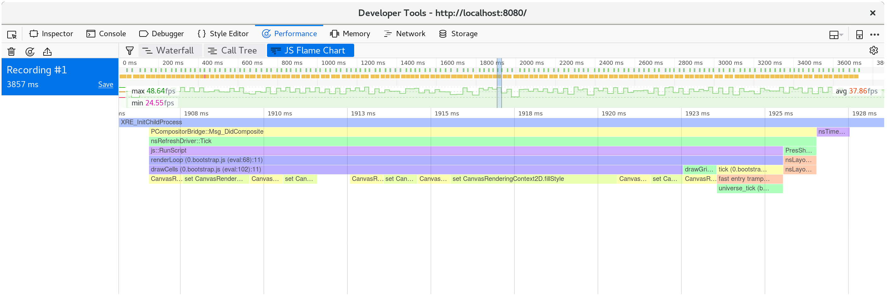

> 🚧 Les captures d'écran de cette page n'ont pas encore été traduites !

<!--
# Time Profiling
-->

# Le profilage temporel

<!--
In this chapter, we will improve the performance of our Game of Life
implementation. We will use time profiling to guide our efforts.
-->

Dans ce chapitre, nous allons améliorer la performance de l'implémentation de
notre jeu de la vie. Nous allons utiliser le profilage temporel pour orienter
notre travail.

<!--
Familiarize yourself with [the available tools for time profiling Rust and
WebAssembly code](../reference/time-profiling.md) before continuing.
-->

Avant de continuer, familiarisez-vous avec [les outils disponibles pour le
profilage temporel pour le code Rust et WebAssembly].

<!--
## Creating a Frames Per Second Timer with the `window.performance.now` Function
-->

## Créer un compteur d'images par seconde avec `window.performance.now`

<!--
This FPS timer will be useful as we investigate speeding up our Game of Life's
rendering.
-->

Ce compteur d'images par seconde sera un indicateur utile lors de nos
recherches d'améliorations de performances du rendu de notre jeu de la vie.

<!--
We start by adding an `fps` object to `wasm-game-of-life/www/index.js`:
-->

Nous allons commencer par rajouter un objet `ips` (pour `Images Par Seconde`) à
`wasm-jeu-de-la-vie/www/index.js` :

<!--
```js
const fps = new class {
  constructor() {
    this.fps = document.getElementById("fps");
    this.frames = [];
    this.lastFrameTimeStamp = performance.now();
  }

  render() {
    // Convert the delta time since the last frame render into a measure
    // of frames per second.
    const now = performance.now();
    const delta = now - this.lastFrameTimeStamp;
    this.lastFrameTimeStamp = now;
    const fps = 1 / delta * 1000;

    // Save only the latest 100 timings.
    this.frames.push(fps);
    if (this.frames.length > 100) {
      this.frames.shift();
    }

    // Find the max, min, and mean of our 100 latest timings.
    let min = Infinity;
    let max = -Infinity;
    let sum = 0;
    for (let i = 0; i < this.frames.length; i++) {
      sum += this.frames[i];
      min = Math.min(this.frames[i], min);
      max = Math.max(this.frames[i], max);
    }
    let mean = sum / this.frames.length;

    // Render the statistics.
    this.fps.textContent = `
Frames per Second:
         latest = ${Math.round(fps)}
avg of last 100 = ${Math.round(mean)}
min of last 100 = ${Math.round(min)}
max of last 100 = ${Math.round(max)}
`.trim();
  }
};
```
-->

```js
const ips = new class {
  constructor() {
    this.ips = document.getElementById("ips");
    this.images = [];
    this.timeStampDeLaDerniereImage = performance.now();
  }

  afficher() {
    // Convertit la différence de temps entre la dernière image en
    // images par seconde.
    const maintenant = performance.now();
    const difference = maintenant - this.timeStampDeLaDerniereImage;
    this.timeStampDeLaDerniereImage = maintenant;
    const ips = 1 / difference * 1000;

    // Ne conserve que les 100 dernières images.
    this.images.push(ips);
    if (this.images.length > 100) {
      this.images.shift();
    }

    // Trouve la valeur minimale, maximale, et la moyenne des
    // 100 dernières images.
    let min = Infinity;
    let max = -Infinity;
    let somme = 0;
    for (let i = 0; i < this.images.length; i++) {
      somme += this.images[i];
      min = Math.min(this.images[i], min);
      max = Math.max(this.images[i], max);
    }
    let moyenne = somme / this.images.length;

    // Affiche les statistiques.
    this.ips.textContent = `
Images Par Seconde :
                           actuel = ${Math.round(ips)}
 moyenne des 100 dernières images = ${Math.round(moyenne)}
mininima des 100 dernières images = ${Math.round(min)}
  maxima des 100 dernières images = ${Math.round(max)}
`.trim();
  }
};
```

<!--
Next we call the `fps` `render` function on each iteration of `renderLoop`:
-->

Ensuite, nous devons appeler la fonction `afficher` à chaque itération de
`boucleDeRendu` :

<!--
```js
const renderLoop = () => {
    fps.render(); //new

    universe.tick();
    drawGrid();
    drawCells();

    animationId = requestAnimationFrame(renderLoop);
};
```
-->

```js
const boucleDeRendu = () => {
    ips.afficher(); //new

    univers.tick();
    dessinerGrille();
    dessinerCellules();

    animationId = requestAnimationFrame(boucleDeRendu);
};
```

<!--
Finally, don't forget to add the `fps` element to
`wasm-game-of-life/www/index.html`, just above the `<canvas>`:
-->

Enfin, n'oubliez pas d'ajouter le noeud `#ips` à
`wasm-jeu-de-la-vie/www/index.html`, juste au-dessus du `<canvas>` :

<!--
```html
<div id="fps"></div>
```
-->

```html
<div id="ips"></div>
```

<!--
And add CSS to make its formatting nice:
-->

Ainsi qu'un peu de style CSS pour améliorer son rendu :

<!--
```css
#fps {
  white-space: pre;
  font-family: monospace;
}
```
-->

```css
#ips {
  white-space: pre;
  font-family: monospace;
}
```

<!--
And voila! Refresh [http://localhost:8080](http://localhost:8080) and now we
have an FPS counter!
-->

Et voilà ! Rafraîchissez la page [http://localhost:8080](http://localhost:8080)
et vous avez maintenant un compteur d'images par seconde !

<!--
[perf-now]: https://developer.mozilla.org/en-US/docs/Web/API/Performance/now
-->

[perf-now]: https://developer.mozilla.org/fr/docs/Web/API/Performance/now

<!--
### Time Each `Universe::tick` with `console.time` and `console.timeEnd`
-->

### Chronomètrer chaque `Univers::tick` avec `console.time` et `console.timeEnd`

<!--
To measure how long each invocation of `Universe::tick` takes, we can use
`console.time` and `console.timeEnd` via the `web-sys` crate.
-->

Pour mesurer la durée que prends chaque appel à `Univers::tick`, nous pouvons
utiliser `console.time` et `console.timeEnd` avec la crate `web-sys`.

<!--
First, add `web-sys` as a dependency to `wasm-game-of-life/Cargo.toml`:
-->

Pour commencer, ajoutez la dépendance `web-sys` dans
`wasm-jeu-de-la-vie/Cargo.toml` :

<!--
```toml
[dependencies.web-sys]
version = "0.3"
features = [
  "console",
]
```
-->

```toml
[dependencies.web-sys]
version = "0.3"
features = [
  "console",
]
```

<!--
Because there should be a corresponding `console.timeEnd` invocation for every
`console.time` call, it is convenient to wrap them both up in an [RAII][] type:
-->

Comme nous aurons un appel à `console.timeEnd` correspondant à chaque appel à
`console.time`, il nous est plus pratique de les intégrer dans un type qui
implémente le concept de [RAII][RAII] :

<!--
```rust
extern crate web_sys;
use web_sys::console;

pub struct Timer<'a> {
    name: &'a str,
}

impl<'a> Timer<'a> {
    pub fn new(name: &'a str) -> Timer<'a> {
        console::time_with_label(name);
        Timer { name }
    }
}

impl<'a> Drop for Timer<'a> {
    fn drop(&mut self) {
        console::time_end_with_label(self.name);
    }
}
```
-->

```rust
extern crate web_sys;
use web_sys::console;

pub struct Chronometre<'a> {
    nom: &'a str,
}

impl<'a> Chronometre<'a> {
    pub fn new(nom: &'a str) -> Chronometre<'a> {
        console::time_with_label(nom);
        Chronometre { nom }
    }
}

impl<'a> Drop for Chronometre<'a> {
    fn drop(&mut self) {
        console::time_end_with_label(self.nom);
    }
}
```

<!--
Then, we can time how long each `Universe::tick` takes by adding this snippet to
the top of the method:
-->

Maintenant, nous pouvons chronométrer le temps que prend `Univers::tick` en
ajoutant ceci en haut de la méthode :

<!--
```rust
let _timer = Timer::new("Universe::tick");
```
-->

```rust
let _chronometre = Chronometre::new("Univers::tick");
```

<!--
The time of how long each call to `Universe::tick` took are now logged in the
console:
-->

La durée de chaque appel à `Univers::tick` est maintenant affichée dans la
console :

<!-- markdownlint-disable -->
<!--
[](../images/game-of-life/console-time.png)
-->
<!-- markdownlint-enable -->

[](../images/game-of-life/console-time.png)

<!-- markdownlint-disable -->
<!--
Additionally, `console.time` and `console.timeEnd` pairs will show up in your
browser's profiler's "timeline" or "waterfall" view:
pp
[](../images/game-of-life/console-time-in-profiler.png)
-->
<!-- markdownlint-enable -->

De plus, les coupes de `console.time` et de `console.timeEnd` vont être mis en
évidence dans la vue "timeline" ou "chronologie" du profileur du navigateur :

[](../images/game-of-life/console-time-in-profiler.png)

<!--
[RAII]: https://en.wikipedia.org/wiki/Resource_acquisition_is_initialization
-->

[RAII]:
https://jimskapt.github.io/rust-book-fr/ch04-01-what-is-ownership.html?highlight=RAII#m%C3%A9moire-et-allocation

<!--
## Growing our Game of Life Universe
-->

## Agrandir l'univers de notre jeu de la vie

<!--
> ⚠️ This section utilizes example screenshots from Firefox. While all modern
> browsers have similar tools, there might be slight nuances to working with
> different developer tools. The profile information you extract will be
> essentially the same, but your mileage might vary in terms of the views you
> see and the naming of different tools.
-->

> ⚠️ Cette section utilise des captures d'écran de Firefox comme exemples. Bien
> que tous les navigateurs ont des outils qui se ressemblent, il peut y avoir
> quelques petites différences lorsque vous travaillez avec des outils de
> développements différents. Les informations du profilage que vous allez
> récupérer sera généralement le même, mais sa représentation peut changer en
> fonction des vues des différents outils que vous aurez et leur façon de nommer
> les choses.

<!--
What happens if we make our Game of Life universe larger? Replacing the 64 by 64
universe with a 128 by 128 universe (by modifying `Universe::new` in
`wasm-game-of-life/src/lib.rs`) results in FPS dropping from a smooth 60 to a
choppy 40-ish on my machine.
-->

Que va-t-il se passer si nous agrandissons l'univers de notre jeu de la vie ?
Remplacer l'univers de 64 par 64 par un univers de 128 par 128 (en modifiant
`Univers::new` dans `wasm-jeu-de-la-vie/src/lib.rs`) va réduire drastiquement
les images par seconde de 60 ips fluide à un 40 ips trouble sur certaines
machines.

<!--
If we record a profile and look at the waterfall view, we see that each
animation frame is taking over 20 milliseconds. Recall that 60 frames per second
leaves sixteen milliseconds for the whole process of rendering a frame. That's
not just our JavaScript and WebAssembly, but also everything else the browser is
doing, such as painting.
-->

Si nous générons un profilage et regardons la vue "chronologie", nous pouvons
constater que chaque image de l'animation prend plus de 20 millisecondes de
calcul. Retenez que 60 images par seconde signifie qu'il se passe environ 16
millisecondes entre chaque image. Cela ne s'applique pas uniquement aux calculs
du JavaScript et du WebAssembly, mais aussi à tout ce que le navigateur fait
d'autre pendant ce temps, comme le rendu et l'affichage à l'écran.

<!-- markdownlint-disable -->
<!--
[](../images/game-of-life/drawCells-before-waterfall.png)
-->
<!-- markdownlint-enable -->

[](../images/game-of-life/drawCells-before-waterfall.png)

<!--
If we look at what happens within a single animation frame, we see that the
`CanvasRenderingContext2D.fillStyle` setter is very expensive!
-->

Si nous analysons ce qui se passe à chaque image de l'animation, on peut voir
que le mutateur `CanvasRenderingContext2D.fillStyle` prend beaucoup de temps !

<!-- markdownlint-disable -->
<!--
> ⚠️ In Firefox, if you see a line that simply says "DOM" instead of the
> `CanvasRenderingContext2D.fillStyle` mentioned above, you may need to turn on
> the option for "Show Gecko Platform Data" in your performance developer tools
> options:
>
> [](../images/game-of-life/profiler-firefox-show-gecko-platform.png)
-->
<!-- markdownlint-enable -->

> ⚠️ Dans Firefox, si vous voyez une ligne qui dit simplement "DOM" au lieu du
> `canvasRenderingContext2D.filleStyle` que nous avons mentionné précédemment,
> vous devriez activer l'option "Afficher les données de la plate-forme Gecko"
> dans les options de vos outils de développement :
>
> [](../images/game-of-life/profiler-firefox-show-gecko-platform.png)

<!-- markdownlint-disable -->
<!--
[](../images/game-of-life/drawCells-before-flamegraph.png)
-->
<!-- markdownlint-enable -->

[](../images/game-of-life/drawCells-before-flamegraph.png)

<!--
And we can confirm that this isn't an abnormality by looking at the call tree's
aggregation of many frames:
-->

Et nous pouvons confirmer que ce n'est pas une anomalie en analysant
l'agrégation de l'arbre d'appels de plusieurs images :

<!-- markdownlint-disable -->
<!--
[](../images/game-of-life/drawCells-before-calltree.png)
-->
<!-- markdownlint-enable -->

[](../images/game-of-life/drawCells-before-calltree.png)

<!--
Nearly 40% of our time is spent in this setter!
-->

On passe presque 40% du temps dans ce mutateur !

<!--
> ⚡ We might have expected something in the `tick` method to be the performance
> bottleneck, but it wasn't. Always let profiling guide your focus, since time
> may be spent in places you don't expect it to be.
-->

> ⚡ Nous pourrions nous attendre à ce que la méthode `tick` explique la perte
> de performances, mais ce n'est pas le cas. Ayez toujours le réflexe d'utiliser
> le profileur pour orienter vos efforts, autrement vous risquez de perdre votre
> temps à optimiser des parties qui sont négligeables en terme de performance.

<!--
In the `drawCells` function in `wasm-game-of-life/www/index.js`, the `fillStyle`
property is set once for every cell in the universe, on every animation frame:
-->

Dans la fonction `dessinerCellules` de `wasm-jeu-de-la-vie/www/index.js`, la
propriété `fillStyle` est définie pour chaque cellule de l'univers, à chaque
image de l'animation.

<!--
```js
for (let row = 0; row < height; row++) {
  for (let col = 0; col < width; col++) {
    const idx = getIndex(row, col);

    ctx.fillStyle = cells[idx] === DEAD
      ? DEAD_COLOR
      : ALIVE_COLOR;

    ctx.fillRect(
      col * (CELL_SIZE + 1) + 1,
      row * (CELL_SIZE + 1) + 1,
      CELL_SIZE,
      CELL_SIZE
    );
  }
}
```
-->

```js
for (let ligne = 0; ligne < hauteur; ligne++) {
  for (let colonne = 0; colonne < largeur; colonne++) {
    const indice = calculerIndice(ligne, colonne);

    ctx.fillStyle = cellules[indice] === Cellule.Morte
      ? COULEUR_MORTE
      : COULEUR_VIVANTE;

    ctx.fillRect(
      colonne * (TAILLE_CELLULE + 1) + 1,
      ligne * (TAILLE_CELLULE + 1) + 1,
      TAILLE_CELLULE,
      TAILLE_CELLULE
    );
  }
}
```

<!--
Now that we have discovered that setting `fillStyle` is so expensive, what can
we do to avoid setting it so often? We need to change `fillStyle` depending on
whether a cell is alive or dead. If we set `fillStyle = ALIVE_COLOR` and then
draw every alive cell in one pass, and then set `fillStyle = DEAD_COLOR` and
draw every dead cell in another pass, then we only end setting `fillStyle`
twice, rather than once for every cell.
-->

Maintenant que nous avons découvert qu'utiliser `fillStyle` est très
chronophage, qu'est-ce que nous pouvons faire pour éviter de l'utiliser aussi
souvent ? Nous devons changer `fillStyle` si une cellule est vivante ou morte.
Si nous faisons en sorte que `fillStyle = COULEUR_VIVANTE` et que nous dessinons
ensuite toutes les cellules vivantes en une seule fois sur une première passe,
et que nous faisons ensuite en sorte que `fillStyle = COULEUR_MORTE` puis que
nous dessinons toutes les cellules mortes en une deuxième passe, alors nous
utilisons `fillStyle` seulement deux fois, plutôt qu'une fois sur chaque
cellule.

<!--
```js
// Alive cells.
ctx.fillStyle = ALIVE_COLOR;
for (let row = 0; row < height; row++) {
  for (let col = 0; col < width; col++) {
    const idx = getIndex(row, col);
    if (cells[idx] !== Cell.Alive) {
      continue;
    }

    ctx.fillRect(
      col * (CELL_SIZE + 1) + 1,
      row * (CELL_SIZE + 1) + 1,
      CELL_SIZE,
      CELL_SIZE
    );
  }
}

// Dead cells.
ctx.fillStyle = DEAD_COLOR;
for (let row = 0; row < height; row++) {
  for (let col = 0; col < width; col++) {
    const idx = getIndex(row, col);
    if (cells[idx] !== Cell.Dead) {
      continue;
    }

    ctx.fillRect(
      col * (CELL_SIZE + 1) + 1,
      row * (CELL_SIZE + 1) + 1,
      CELL_SIZE,
      CELL_SIZE
    );
  }
}
```
-->

```js
// Cellules vivantes.
ctx.fillStyle = COULEUR_VIVANTE;
for (let ligne = 0; ligne < hauteur; ligne++) {
  for (let colonne = 0; colonne < largeur; colonne++) {
    const indice = calculerIndice(ligne, colonne);
    if (cellules[indice] !== Cellule.Vivante) {
      continue;
    }

    ctx.fillRect(
      colonne * (TAILLE_CELLULE + 1) + 1,
      ligne * (TAILLE_CELLULE + 1) + 1,
      TAILLE_CELLULE,
      TAILLE_CELLULE
    );
  }
}

// Cellules mortes.
ctx.fillStyle = COULEUR_MORTE;
for (let ligne = 0; ligne < hauteur; ligne++) {
  for (let colonne = 0; colonne < largeur; colonne++) {
    const indice = calculerIndice(ligne, colonne);
    if (cellules[indice] !== Cellule.Morte) {
      continue;
    }

    ctx.fillRect(
      colonne * (TAILLE_CELLULE + 1) + 1,
      ligne * (TAILLE_CELLULE + 1) + 1,
      TAILLE_CELLULE,
      TAILLE_CELLULE
    );
  }
}
```

<!--
After saving these changes and refreshing
[http://localhost:8080/](http://localhost:8080/), rendering is back to a smooth
60 frames per second.
-->

Après avoir sauvegardé ces changements et rafraîchi
[http://localhost:8080/](http://localhost:8080/), le rendu est à nouveau fluide
à 60 images par secondes.

<!--
If we take another profile, we can see that only about ten milliseconds are
spent in each animation frame now.
-->

Si nous générons un nouveau profilage, nous pouvons constater que maintenant
seulement 10 millisecondes se passent entre chaque image.

<!-- markdownlint-disable -->
<!--
[](../images/game-of-life/drawCells-after-waterfall.png)
-->
<!-- markdownlint-enable -->

[](../images/game-of-life/drawCells-after-waterfall.png)

<!--
Breaking down a single frame, we see that the `fillStyle` cost is gone, and most
of our frame's time is spent within `fillRect`, drawing each cell's rectangle.
-->

En décomposant image par image, on constate que cette utilisation de `fillStyle`
n'a plus de impact lourd, et que la plupart du temps de calcul de notre image se
passe dans `fillRect`, qui dessine le rectangle de chaque cellule.

<!-- markdownlint-disable -->
<!--
[](../images/game-of-life/drawCells-after-flamegraph.png)
-->
<!-- markdownlint-enable -->

[](../images/game-of-life/drawCells-after-flamegraph.png)

<!--
## Making Time Run Faster
-->

## Faire en sorte que le temps s'accélère

<!--
Some folks don't like waiting around, and would prefer if instead of one tick of
the universe occurred per animation frame, nine ticks did. We can modify the
`renderLoop` function in `wasm-game-of-life/www/index.js` to do this quite
easily:
-->

Certaines personnes n'aiment pas attendre, et préfèrent qu'au lieu d'un seul
tick de l'univers se déroule à chaque image de l'animation, il se passe neuf
ticks. Nous pouvons modifier la fonction `boucleDeRendu` dans
`wasm-jeu-de-la-vie/www/index.js` pour implémenter cela facilement :

<!--
```js
for (let i = 0; i < 9; i++) {
  universe.tick();
}
```
-->

```js
for (let i = 0; i < 9; i++) {
  univers.tick();
}
```

<!--
On my machine, this brings us back down to only 35 frames per second. No
good. We want that buttery 60!
-->

Sur certaines machines, cela nous ralentit à seulement 35 images par secondes.
Ce n'est pas bon, nous voulons en avoir 60 !

<!--
Now we know that time is being spent in `Universe::tick`, so let's add some
`Timer`s to wrap various bits of it in `console.time` and `console.timeEnd`
calls, and see where that leads us. My hypothesis is that allocating a new
vector of cells and freeing the old vector on every tick is costly, and taking
up a significant portion of our time budget.
-->

Nous savons maintenant que le calcul de `Univers::tick` prend plus de temps,
donc nous allons ajouter quelques chronomètres pour couvrir certaines de ses
parties avec les appels à `console.time` et `console.timeEnd` pour voir ce que
cela peut nous apprendre. Notre hypothèse est que l'allocation d'un nouveau
vecteur de cellules et le nettoyage de l'ancien vecteur à chaque tick est
coûteux, et nous impute d'une partie importante de notre enveloppe de temps.

<!--
```rust
pub fn tick(&mut self) {
    let _timer = Timer::new("Universe::tick");

    let mut next = {
        let _timer = Timer::new("allocate next cells");
        self.cells.clone()
    };

    {
        let _timer = Timer::new("new generation");
        for row in 0..self.height {
            for col in 0..self.width {
                let idx = self.get_index(row, col);
                let cell = self.cells[idx];
                let live_neighbors = self.live_neighbor_count(row, col);

                let next_cell = match (cell, live_neighbors) {
                    // Rule 1: Any live cell with fewer than two live neighbours
                    // dies, as if caused by underpopulation.
                    (Cell::Alive, x) if x < 2 => Cell::Dead,
                    // Rule 2: Any live cell with two or three live neighbours
                    // lives on to the next generation.
                    (Cell::Alive, 2) | (Cell::Alive, 3) => Cell::Alive,
                    // Rule 3: Any live cell with more than three live
                    // neighbours dies, as if by overpopulation.
                    (Cell::Alive, x) if x > 3 => Cell::Dead,
                    // Rule 4: Any dead cell with exactly three live neighbours
                    // becomes a live cell, as if by reproduction.
                    (Cell::Dead, 3) => Cell::Alive,
                    // All other cells remain in the same state.
                    (otherwise, _) => otherwise,
                };

                next[idx] = next_cell;
            }
        }
    }

    let _timer = Timer::new("free old cells");
    self.cells = next;
}
```
-->

```rust
pub fn tick(&mut self) {
    let _chronometre = Chronometre::new("Univers::tick");

    let mut generation_suivante = {
        let _chronometre = Chronometre::new("création cellules prochaine génération");
        self.cellules.clone()
    };

    {
        let _chronometre = Chronometre::new("calcul nouvelle génération");
        for ligne in 0..self.hauteur {
            for colonne in 0..self.largeur {
                let indice = self.calculer_indice(ligne, colonne);
                let cellule = self.cellules[indice];
                let voisines_vivantes = self.compter_voisines_vivantes(ligne, colonne);

                let prochain_etat = match (cellule, voisines_vivantes) {
                    // Règle 1 : toute cellule vivante avec moins de deux
                    // voisines vivantes meurt, comme si cela était un effet de
                    //  sous-population.
                    (Cellule::Vivante, x) if x < 2 => Cellule::Morte,
                    // Règle 2 : toute cellule vivante avec deux ou trois
                    // voisines vivantes survit jusqu'à la prochaine génération.
                    (Cellule::Vivante, 2) | (Cellule::Vivante, 3) => Cellule::Vivante,
                    // Règle 3 : toute cellule vivante avec plus de trois
                    // voisines vivantes meurt, comme si cela était un effet de
                    // surpopulation.
                    (Cellule::Vivante, x) if x > 3 => Cellule::Morte,
                    // Règle 4 : toute cellule morte avec exactement trois
                    // voisines vivantes devient une cellule vivante, comme si
                    // cela était un effet de reproduction.
                    (Cellule::Morte, 3) => Cellule::Vivante,
                    // Les cellules qui ne répondent à aucune de ces conditions
                    // restent dans le même état.
                    (statut, _) => statut,
                };

                generation_suivante[indice] = prochain_etat;
            }
        }
    }

    let _chronometre = Chronometre::new("nettoyage des anciennes cellules");
    self.cellules = generation_suivante;
}
```

<!--
Looking at the timings, it is clear that my hypothesis is incorrect: the vast
majority of time is spent actually calculating the next generation of
cells. Allocating and freeing a vector on every tick appears to have negligible
cost, surprisingly. Another reminder to always guide our efforts with profiling!
-->

Vu les résultats des chronomètres, il est clair que notre hypothèse est
incorrecte : l'écrasante majorité du temps est consacré à calculer la prochaine
génération des cellules. L'allocation et le nettoyage d'un vecteur à chaque tick
est un coût négligeable, contre toute attente. Voilà une bonne raison de
toujours orienter vos efforts avec le profilage !

<!-- markdownlint-disable -->
<!--
[](../images/game-of-life/console-time-in-universe-tick.png)
-->
<!-- markdownlint-enable -->

[](../images/game-of-life/console-time-in-universe-tick.png)

<!-- markdownlint-disable -->
<!--
The next section requires the `nightly` compiler. It's required because of
the [test feature gate](https://doc.rust-lang.org/unstable-book/library-features/test.html)
we're going to use for the benchmarks. Another tool we will install is [cargo benchcmp][benchcmp].
It's a small utility for comparing micro-benchmarks produced by `cargo bench`.
-->
<!-- markdownlint-enable -->

<!--
[benchcmp]: https://github.com/BurntSushi/cargo-benchcmp
-->

[benchcmp]: https://github.com/BurntSushi/cargo-benchcmp

<!--
Let's write a native code `#[bench]` doing the same thing that our WebAssembly
is doing, but where we can use more mature profiling tools. Here is the new
`wasm-game-of-life/benches/bench.rs`:
-->

Ecrivons un code natif avec `#[bench]` qui fait les mêmes choses que notre
WebAssembly, mais où nous pouvons utiliser des outils de profilage plus mâtures.
Voici le nouveau fichier `wasm-jeu-de-la-vie/benches/bench.rs` :

<!--
```rust
#![feature(test)]

extern crate test;
extern crate wasm_game_of_life;

#[bench]
fn universe_ticks(b: &mut test::Bencher) {
    let mut universe = wasm_game_of_life::Universe::new();

    b.iter(|| {
        universe.tick();
    });
}
```
-->

```rust
#![feature(test)]

extern crate test;
extern crate wasm_jeu_de_la_vie;

#[bench]
fn ticks_univers(b: &mut test::Bencher) {
    let mut univers = wasm_jeu_de_la_vie::Univers::new();

    b.iter(|| {
        univers.tick();
    });
}
```

<!--
We also have to comment out all the `#[wasm_bindgen]` annotations, and the
`"cdylib"` bits from `Cargo.toml` or else building native code will fail and
have link errors.
-->

Nous devons également commenter toutes les annotations `#[wasm_bindgen]`, et les
parties `"cdylib"` dans le `Cargo.toml`, car sinon la compilation du code natif
va échouer et aura des erreurs de liaisons avec des bibliothèques.

<!-- markdownlint-disable -->
<!--
With all that in place, we can run `cargo bench | tee before.txt` to compile and run our
benchmark! The `| tee before.txt` part will take the output from `cargo bench` and put in a file
called `before.txt`.
-->
<!-- markdownlint-enable -->

Une fois ceci en place, nous pouvons exécuter `cargo bench | tee avant.txt` pour
compiler et exécuter notre comparatif ! La partie `| tee avant.txt` va récupérer
la sortie de `cargo bench` et l'écrire dans le fichier `avant.txt`.

<!--
```
$ cargo bench | tee before.txt
    Finished release [optimized + debuginfo] target(s) in 0.0 secs
     Running target/release/deps/wasm_game_of_life-91574dfbe2b5a124

running 0 tests

test result: ok. 0 passed; 0 failed; 0 ignored; 0 measured; 0 filtered out

     Running target/release/deps/bench-8474091a05cfa2d9

running 1 test
test universe_ticks ... bench:     664,421 ns/iter (+/- 51,926)

test result: ok. 0 passed; 0 failed; 0 ignored; 1 measured; 0 filtered out
```
-->

```txt
$ cargo bench | tee avant.txt
    Finished release [optimized + debuginfo] target(s) in 0.0 secs
     Running target/release/deps/wasm_jeu_de_la_vie-91574dfbe2b5a124

running 0 tests

test result: ok. 0 passed; 0 failed; 0 ignored; 0 measured; 0 filtered out

     Running target/release/deps/bench-8474091a05cfa2d9

running 1 test
test ticks_univers ... bench:     664,421 ns/iter (+/- 51,926)

test result: ok. 0 passed; 0 failed; 0 ignored; 1 measured; 0 filtered out
```

<!--
This also tells us where the binary lives, and we can run the benchmarks again,
but this time under our operating system's profiler. In my case, I'm running
Linux, so [`perf`][perf] is the profiler I'll use:
-->

Cela va aussi nous indiquer où est le binaire, et nous pourrons à nouveau
exécuter le comparatif, mais cette fois avec le profileur de notre système
d'exploitation. Dans notre cas, nous l'exécutons sous Linux, donc nous allons
utiliser [`perf`][perf] :

<!--
[perf]: https://perf.wiki.kernel.org/index.php/Main_Page
-->

[perf]: https://perf.wiki.kernel.org/index.php/Main_Page

<!--
```
$ perf record -g target/release/deps/bench-8474091a05cfa2d9 --bench
running 1 test
test universe_ticks ... bench:     635,061 ns/iter (+/- 38,764)

test result: ok. 0 passed; 0 failed; 0 ignored; 1 measured; 0 filtered out

[ perf record: Woken up 1 times to write data ]
[ perf record: Captured and wrote 0.178 MB perf.data (2349 samples) ]
```
-->

```txt
$ perf record -g target/release/deps/bench-8474091a05cfa2d9 --bench
running 1 test
test ticks_univers ... bench:     635,061 ns/iter (+/- 38,764)

test result: ok. 0 passed; 0 failed; 0 ignored; 1 measured; 0 filtered out

[ perf record: Woken up 1 times to write data ]
[ perf record: Captured and wrote 0.178 MB perf.data (2349 samples) ]
```

<!--
Loading up the profile with `perf report` shows that all of our time is spent in
`Universe::tick`, as expected:
-->

L'ouverture du profil avec `perf report` nous montre que tout le temps est passé
dans `Univers::tick`, comme nous nous y attendions :

<!-- markdownlint-disable -->
<!--
[](../images/game-of-life/bench-perf-report.png)
-->
<!-- markdownlint-enable -->

[](../images/game-of-life/bench-perf-report.png)

<!--
`perf` will annotate which instructions in a function time is being spent at if
you press `a`:
-->

`perf` va annoter quel temp est passé dans chaque instruction si vous appuyez
sur `a` :

<!-- markdownlint-disable -->
<!--
[](../images/game-of-life/bench-perf-annotate.png)
-->
<!-- markdownlint-enable -->

[](../images/game-of-life/bench-perf-annotate.png)

<!--
This tells us that 26.67% of time is being spent summing neighboring cells'
values, 23.41% of time is spent getting the neighbor's column index, and another
15.42% of time is spent getting the neighbor's row index. Of these top three
most expensive instructions, the second and third are both costly `div`
instructions. These `div`s implement the modulo indexing logic in
`Universe::live_neighbor_count`.
-->

On apprend donc que 26.67% du temps est passé au comptage des cellules voisines,
que 23.41% du temps est consacré à calculer l'indice de la colonne
correspondante à la cellule voisine, et que 15.42% du temps en plus est passé à
obtenir l'indice de la ligne de la voisine. Parmi ces trois instructions
coûteuses, la seconde et la troisième sont des instructions `div` (pour
division) assez coûteuses. Ces divisions sont implémentées dans la logique
d'indexation faisant appel aux modulos, dans
`Univers::compter_voisines_vivantes`.

<!--
Recall the `live_neighbor_count` definition inside
`wasm-game-of-life/src/lib.rs`:
-->

Souvenez-vous de la définition de `compter_voisines_vivantes` dans
`wasm-jeu-de-la-vie/src/lib.rs` :

<!--
```rust
fn live_neighbor_count(&self, row: u32, column: u32) -> u8 {
    let mut count = 0;
    for delta_row in [self.height - 1, 0, 1].iter().cloned() {
        for delta_col in [self.width - 1, 0, 1].iter().cloned() {
            if delta_row == 0 && delta_col == 0 {
                continue;
            }

            let neighbor_row = (row + delta_row) % self.height;
            let neighbor_col = (column + delta_col) % self.width;
            let idx = self.get_index(neighbor_row, neighbor_col);
            count += self.cells[idx] as u8;
        }
    }
    count
}
```
-->

```rust
fn compter_voisines_vivantes(&self, ligne: u32, colonne: u32) -> u8 {
    let mut compteur = 0;
    for delta_ligne in [self.hauteur - 1, 0, 1].iter().cloned() {
        for delta_colonne in [self.largeur - 1, 0, 1].iter().cloned() {
            if delta_ligne == 0 && delta_colonne == 0 {
                continue;
            }

            let ligne_voisine = (ligne + delta_ligne) % self.hauteur;
            let colonne_voisine = (colonne + delta_colonne) % self.largeur;
            let indice = self.calculer_indice(ligne_voisine, colonne_voisine);
            compteur += self.cellules[indice] as u8;
        }
    }
    compteur
}
```

<!--
The reason we used modulo was to avoid cluttering up the code with `if` branches
for the first or last row or column edge cases. But we are paying the cost of a
`div` instruction even for the most common case, when neither `row` nor `column`
is on the edge of the universe and they don't need the modulo wrapping
treatment. Instead, if we use `if`s for the edge cases and unroll this loop, the
branches *should* be very well-predicted by the CPU's branch predictor.
-->

La raison pour laquelle nous avions utilisé le modulo était d'éviter d'encombrer
le code avec des branches `if` pour gérer les cas des bords des premières lignes
et colonnes. Mais nous payons le prix de l'utilisation des instructions de
division même pour les cas les plus courants, c'est-à-dire lorsque ni `ligne`,
ni la `colonne` ne se trouvent pas sur les bords de l'univers et n'ont pas
besoin du traitement du rebouclage avec le modulo. Mais si à la place nous
utilisons des `if` pour détecter les cas des bordures et dérouler cette boucle,
les branches *devraient* être bien appréhendées par le prédicteur de branches du
CPU.

<!--
Let's rewrite `live_neighbor_count` like this:
-->

Ré-écrivons `compter_voisines_vivantes` de cette manière :

<!--
```rust
fn live_neighbor_count(&self, row: u32, column: u32) -> u8 {
    let mut count = 0;

    let north = if row == 0 {
        self.height - 1
    } else {
        row - 1
    };

    let south = if row == self.height - 1 {
        0
    } else {
        row + 1
    };

    let west = if column == 0 {
        self.width - 1
    } else {
        column - 1
    };

    let east = if column == self.width - 1 {
        0
    } else {
        column + 1
    };

    let nw = self.get_index(north, west);
    count += self.cells[nw] as u8;

    let n = self.get_index(north, column);
    count += self.cells[n] as u8;

    let ne = self.get_index(north, east);
    count += self.cells[ne] as u8;

    let w = self.get_index(row, west);
    count += self.cells[w] as u8;

    let e = self.get_index(row, east);
    count += self.cells[e] as u8;

    let sw = self.get_index(south, west);
    count += self.cells[sw] as u8;

    let s = self.get_index(south, column);
    count += self.cells[s] as u8;

    let se = self.get_index(south, east);
    count += self.cells[se] as u8;

    count
}
```
-->

```rust
fn compter_voisines_vivantes(&self, ligne: u32, colonne: u32) -> u8 {
    let mut compteur = 0;

    let nord = if ligne == 0 {
        self.hauteur - 1
    } else {
        ligne - 1
    };

    let sud = if ligne == self.hauteur - 1 {
        0
    } else {
        ligne + 1
    };

    let ouest = if colonne == 0 {
        self.largeur - 1
    } else {
        colonne - 1
    };

    let est = if colonne == self.largeur - 1 {
        0
    } else {
        colonne + 1
    };

    let no = self.calculer_indice(nord, ouest);
    compteur += self.cellules[no] as u8;

    let n = self.calculer_indice(nord, colonne);
    compteur += self.cellules[n] as u8;

    let ne = self.calculer_indice(nord, est);
    compteur += self.cellules[ne] as u8;

    let o = self.calculer_indice(ligne, ouest);
    compteur += self.cellules[o] as u8;

    let e = self.calculer_indice(ligne, est);
    compteur += self.cellules[e] as u8;

    let so = self.calculer_indice(sud, ouest);
    compteur += self.cellules[so] as u8;

    let s = self.calculer_indice(sud, colonne);
    compteur += self.cellules[s] as u8;

    let se = self.calculer_indice(sud, est);
    compteur += self.cellules[se] as u8;

    compteur
}
```

<!--
Now let's run the benchmarks again! This time output it to `after.txt`.
-->

Lançons à nouveau les comparatifs ! Et cette fois nous allons l'enregistrer dans
`apres.txt`.

<!--
```
$ cargo bench | tee after.txt
   Compiling wasm_game_of_life v0.1.0 (file:///home/fitzgen/wasm_game_of_life)
    Finished release [optimized + debuginfo] target(s) in 0.82 secs
     Running target/release/deps/wasm_game_of_life-91574dfbe2b5a124

running 0 tests

test result: ok. 0 passed; 0 failed; 0 ignored; 0 measured; 0 filtered out

     Running target/release/deps/bench-8474091a05cfa2d9

running 1 test
test universe_ticks ... bench:      87,258 ns/iter (+/- 14,632)

test result: ok. 0 passed; 0 failed; 0 ignored; 1 measured; 0 filtered out
```
-->

```txt
$ cargo bench | tee apres.txt
   Compiling wasm_jeu_de_la_vie v0.1.0 (file:///home/fitzgen/wasm_jeu_de_la_vie)
    Finished release [optimized + debuginfo] target(s) in 0.82 secs
     Running target/release/deps/wasm_jeu_de_la_vie-91574dfbe2b5a124

running 0 tests

test result: ok. 0 passed; 0 failed; 0 ignored; 0 measured; 0 filtered out

     Running target/release/deps/bench-8474091a05cfa2d9

running 1 test
test ticks_univers ... bench:      87,258 ns/iter (+/- 14,632)

test result: ok. 0 passed; 0 failed; 0 ignored; 1 measured; 0 filtered out
```

<!-- markdownlint-disable -->
<!--
That looks a whole lot better! We can see just how much better it is with the `benchcmp` tool and the two text files we created before:
-->
<!-- markdownlint-enable -->

On dirait que cela a fait du bien ! Nous pouvons constater les améliorations
grâce à l'outil `benchcmp` et des deux fichiers texte que nous avons créé
précédemment :

<!-- markdownlint-disable -->
<!--
```
$ cargo benchcmp before.txt after.txt
 name            before.txt ns/iter  after.txt ns/iter  diff ns/iter   diff %  speedup
 universe_ticks  664,421             87,258                 -577,163  -86.87%   x 7.61
```
-->
<!-- markdownlint-enable -->

```txt
$ cargo benchcmp avant.txt apres.txt
 name            before.txt ns/iter  after.txt ns/iter  diff ns/iter   diff %  speedup
 universe_ticks  664,421             87,258                 -577,163  -86.87%   x 7.61
```

<!--
Wow! 7.61x speed up!
-->

Ouah ! C'est 7.61 fois plus rapide !

<!--
WebAssembly intentionally maps closely to common hardware architectures, but we
do need to make sure that this native code speed up translates into a
WebAssembly speed up as well.
-->

Le WebAssembly aspire à ressembler au plus aux architectures matérielles les
plus courantes, mais nous devons nous assurer que ces améliorations des
performances s'appliquent aussi au WebAssembly.

<!--
Let's rebuild the `.wasm` with `wasm-pack build` and refresh
[http://localhost:8080/](http://localhost:8080/). On my machine, the page is
running at 60 frames per second again, and recording another profile with the
browser's profiler reveals that each animation frame is taking about ten
milliseconds.
-->

Recompilons le `.wasm` avec `wasm-pack build` et rafraîchissons
[http://localhost:8080/](http://localhost:8080/). Sur certaines machines, cette
page s'exécute à nouveau à 60 images par secondes, et l'enregistrement d'un
nouveau profil avec le profileur du navigateur dans ce cas nous apprendra que
chaque image de l'animation se calcule en environ dix millisecondes.

<!--
Success!
-->

Victoire !

<!-- markdownlint-disable -->
<!--
[](../images/game-of-life/waterfall-after-branches-and-unrolling.png)
-->
<!-- markdownlint-enable -->

[](../images/game-of-life/waterfall-after-branches-and-unrolling.png)

<!--
## Exercises
-->

## Exercices

<!--
* At this point, the next lowest hanging fruit for speeding up `Universe::tick`
  is removing the allocation and free. Implement double buffering of cells,
  where the `Universe` maintains two vectors, never frees either of them, and
  never allocates new buffers in `tick`.
-->

* A ce stade, l'optimisation la plus accessible pour `Univers::tick` est
  d'enlever l'allocation et la libération en mémoire. Pour cela, implémentez le
  *double buffering* des cellules, avec lequel `Univers` contient deux vecteurs,
  qui ne seront jamais libérés, et n'alloue jamais de nouveaux tampons dans la
  fonction `tick`.

<!--
* Implement the alternative, delta-based design from the "Implementing Life"
  chapter, where the Rust code returns a list of cells that changed states to
  JavaScript. Does this make rendering to `<canvas>` faster? Can you implement
  this design without allocating a new list of deltas on every tick?
-->

* Essayez d'implémenter une alternative, un concept du chapitre "Implémenter le
  jeu de la vie de Conway", basé sur les différences, dans lequel le code Rust
  retourne la liste des cellules qui ont changé d'état au JavaScript. Est-ce que
  cela améliore la rapidité du rendu du `<canvas>` ? Pouvez-vous implémenter ce
  concept sans allouer une nouvelle liste de différences à chaque `tick` ?

<!-- markdownlint-disable -->
<!--
* As our profiling has shown us, 2D `<canvas>` rendering is not particularly
  fast. Replace the 2D canvas renderer with a [WebGL][webgl] renderer. How much faster is
  the WebGL version? How large can you make the universe before WebGL rendering
  is a bottleneck?
-->
<!-- markdownlint-enable -->

* Comme le profilage nous l'as appris, le rendu 2D du `<canvas>` n'est pas
  particulièrement rapide. Essayez de remplacer le rendu 2D du canvas par un
  rendu avec [WebGL][webgl]. Quels sont les gains de performance ? A partir de
  quelle taille de l'univers le rendu en WebGL améliore les performances ?

<!--
[webgl]: https://developer.mozilla.org/en-US/docs/Web/API/WebGL_API
-->

[webgl]: https://developer.mozilla.org/fr/docs/Web/API/WebGL_API
