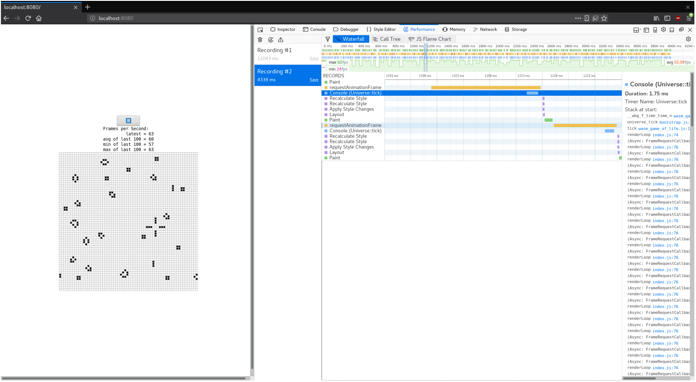

<!--
# Time Profiling
-->

# Le profilage temporel

<!--
This section describes how to profile Web pages using Rust and WebAssembly where
the goal is improving throughput or latency.
-->

Cette section décrit comment profiler des pages web qui utilise Rust et
WebAssembly dans le but d'améliorer le débit ou de réduire la latence.

<!--
> ⚡ Always make sure you are using an optimized build when profiling! `wasm-pack
> build` will build with optimizations by default.
-->

> ⚡ Assurez-vous que vous utilisez toujours une compilation optimisée lorsque
> vous faites un profilage ! `wasm-pack build` devrait compiler avec les
> optimisations par défaut.

<!--
## Available Tools
-->

## Les outils disponibles

<!--
### The `window.performance.now()` Timer
-->

### Le chronomètre `window.performance.now()`

<!--
[The `performance.now()` function][perf-now] returns a monotonic timestamp
measured in milliseconds since the Web page was loaded.
-->

[La fonction `performance.now()`][perf-now] retourne un chronomètre en
millisecondes qui commence depuis que la page web a été chargée.

<!--
Calling `performance.now` has little overhead, so we can create simple, granular
measurements from it without distorting the performance of the rest of the
system and inflicting bias upon our measurements.
-->

L'appel à `performance.now` n'a que très peu d'impact sur les performances, donc
nous pouvons créer des mesures simples et granulaires grâce à elle sans impacter
le reste du système et sans introduire de biais à ces mesures.

<!--
We can use it to time various operations, and we can access
`window.performance.now()` via [the `web-sys` crate][web-sys]:
-->

Nous pouvons l'utiliser pour chronométrer différentes opérations, et nous
pouvons accéder à `window.performance.now()` via [la crate `web-sys`][web-sys] :

<!--
```rust
extern crate web_sys;

fn now() -> f64 {
    web_sys::window()
        .expect("should have a Window")
        .performance()
        .expect("should have a Performance")
        .now()
}
```
-->

```rust
extern crate web_sys;

fn now() -> f64 {
    web_sys::window()
        .expect("nous n'avons pas accès à l'objet `window`")
        .performance()
        .expect("nous n'avons pas accès à l'objet `window.performance`")
        .now()
}
```

<!-- markdownlint-disable -->
<!--
* [The `web_sys::window` function](https://rustwasm.github.io/wasm-bindgen/api/web_sys/fn.window.html)
* [The `web_sys::Window::performance` method](https://rustwasm.github.io/wasm-bindgen/api/web_sys/struct.Window.html#method.performance)
* [The `web_sys::Performance::now` method](https://rustwasm.github.io/wasm-bindgen/api/web_sys/struct.Performance.html#method.now)
-->
<!-- markdownlint-restore -->

* [Documentation de la fonction `web_sys::window`][doc:web_sys::window]
* [Documentation de la méthode
  `web_sys::Window::performance`][doc:web_sys::Window::performance]
* [Documentation de la méthode
  `web_sys::Performance::now`][doc:web_sys::Performance::now]

<!--
[perf-now]: https://developer.mozilla.org/en-US/docs/Web/API/Performance/now
-->

[perf-now]: https://developer.mozilla.org/fr/docs/Web/API/Performance/now
[doc:web_sys::window]:
https://rustwasm.github.io/wasm-bindgen/api/web_sys/fn.window.html
[doc:web_sys::Window::performance]:
https://rustwasm.github.io/wasm-bindgen/api/web_sys/struct.Window.html#method.performance
[doc:web_sys::Performance::now]:
https://rustwasm.github.io/wasm-bindgen/api/web_sys/struct.Performance.html#method.now

<!--
### Developer Tools Profilers
-->

### Les profileurs des outils de développement

<!--
All Web browsers' built-in developer tools include a profiler. These profilers
display which functions are taking the most time with the usual kinds of
visualizations like call trees and flame graphs.
-->

Tous les outils de développement intégrés dans les navigateurs web embarquent un
profileur. Ces profileurs mettent en évidence les fonctions qui prennent le plus
de temps à s'exécuter avec les outils de visualisation habituels comme les
arbres d'appels et les *flame graphs*.

<!--
If you [build with debug symbols][symbols] so that the "name" custom section is
included in the wasm binary, then these profilers should display the Rust
function names instead of something opaque like `wasm-function[123]`.
-->

Si vous [compilez avec les symboles de déboguage][symbols] afin que la section
personnalisée "name" soit ajoutée dans le binaire wasm, alors ces profileurs
devraient afficher les noms des fonctions Rust plutôt qu'un nom obscur comme
`wasm-function[123]`.

<!--
Note that these profilers *won't* show inlined functions, and since Rust and
LLVM rely on inlining so heavily, the results might still end up a bit
perplexing.
-->

Sachez toutefois que ces profileurs *ne vont pas* montrer les fonctions
intégrées, et comme Rust et LLVM utilisent beaucoup de fonction intégrées, les
résultats deviendraient compliqués.

<!--
[symbols]: ./debugging.html#building-with-debug-symbols
-->

[symbols]: ./debugging.html

<!-- markdownlint-disable -->
<!--
[](../images/game-of-life/profiler-with-rust-names.png)
-->
<!-- markdownlint-enable -->

[](images/game-of-life/profiler-with-rust-names.png)

<!--
#### Resources
-->

#### Ressources sur les profileurs web

<!-- markdownlint-disable -->
<!--
* [Firefox Developer Tools — Performance](https://developer.mozilla.org/en-US/docs/Tools/Performance)
* [Microsoft Edge Developer Tools — Performance](https://docs.microsoft.com/en-us/microsoft-edge/devtools-guide/performance)
* [Chrome DevTools JavaScript Profiler](https://developers.google.com/web/tools/chrome-devtools/rendering-tools/js-execution)
-->
<!-- markdownlint-enable -->

* [Outils de développement de Firefox — Performance][doc:firefox:performance]
* [Outils de développement de Microsoft Edge — Performance][doc:msedge:performance]
* [Profileur JavaScript de Chrome DevTools][doc:chrome:profiler]

[doc:firefox:performance]:
https://developer.mozilla.org/fr/docs/Outils/Performance
[doc:msedge:performance]:
https://docs.microsoft.com/fr-fr/microsoft-edge/devtools-guide/performance
[doc:chrome:profiler]:
https://developers.google.com/web/tools/chrome-devtools/rendering-tools/js-execution

<!--
### The `console.time` and `console.timeEnd` Functions
-->

### Les fonctions `console.time` et `console.timeEnd`

<!--
[The `console.time` and `console.timeEnd` functions][console-time] allow you to
log the timing of named operations to the browser's developer tools console. You
call `console.time("some operation")` when the operation begins, and call
`console.timeEnd("some operation")` when it finishes. The string label naming
the operation is optional.
-->

[Les fonctions `console.time` et `console.timeEnd`][console-time] vous
permettent de journaliser la chronologie des opérations demandées dans la
console d'outils de développements du navigateur. Vous pouvez appeler
`console.time("le nom de l'opération")` lorsque l'opération commence, et appeler
`console.timeEnd("le nom de l'opération")` lorsqu'elle se termine. Le nom de
l'opération est optionnel.

<!--
You can use these functions directly via [the `web-sys` crate][web-sys]:
-->

Vous pouvez utiliser directement ces fonctions [avec la crate
`web-sys`][web-sys] :

<!-- markdownlint-disable -->
<!--
* [`web_sys::console::time_with_label("some
  operation")`](https://rustwasm.github.io/wasm-bindgen/api/web_sys/console/fn.time_with_label.html)
* [`web_sys::console::time_end_with_label("some
  operation")`](https://rustwasm.github.io/wasm-bindgen/api/web_sys/console/fn.time_end_with_label.html)
-->
<!-- markdownlint-enable -->

* [`web_sys::console::time_with_label("une opération")`][time_with_label]
* [`web_sys::console::time_end_with_label("une opération")`][time_end_with_label]

[time_with_label]:
https://rustwasm.github.io/wasm-bindgen/api/web_sys/console/fn.time_with_label.html
[time_end_with_label]:
https://rustwasm.github.io/wasm-bindgen/api/web_sys/console/fn.time_end_with_label.html

<!--
Here is a screenshot of `console.time` logs in the browser's console:
-->

Voici une capture d'écran des journaux de `console.time` dans la console du
navigateur :

<!-- markdownlint-disable -->
<!--
[](../images/game-of-life/console-time.png)
-->
<!-- markdownlint-enable -->

[](images/game-of-life/console-time.png)

<!--
Additionally, `console.time` and `console.timeEnd` logs will show up in your
browser's profiler's "timeline" or "waterfall" view:
-->

De plus, les journaux de `console.time` et de `console.timeEnd` vont s'afficher
dans les vues "timeline" ou "chronologie" du profileur de votre navigateur :

<!-- markdownlint-disable -->
<!--
[](../images/game-of-life/console-time-in-profiler.png)
-->
<!-- markdownlint-enable -->

[](images/game-of-life/console-time-in-profiler.png)

<!--
[console-time]: https://developer.mozilla.org/en-US/docs/Web/API/Console/time
-->

[console-time]: https://developer.mozilla.org/fr/docs/Web/API/Console/time

<!--
### Using `#[bench]` with Native Code
-->

### Utiliser `#[bench]` sur du code natif

<!--
The same way we can often leverage our operating system's native code debugging
tools by writing `#[test]`s rather than debugging on the Web, we can leverage
our operating system's native code profiling tools by writing `#[bench]`
functions.
-->

De la même manière que nous pouvons tirer avantage des outils de déboguage de
code de notre système d'exploitation en créant des fonctions `#[test]` plutôt
que de déboguer sur le web, nous pouvons tirer avantage des outils de profilage
de code de notre système d'exploitation en créant des fonctions `#[bench]`.

<!--
Write your benchmarks in the `benches` subdirectory of your crate. Make sure
that your `crate-type` includes `"rlib"` or else the bench binaries won't be
able to link your main lib.
-->

Ecrivez vos tests de performance dans le sous-dossier `benches` de votre crate.
Assurez-vous que votre `crate-type` inclut bien `"rlib"` ou sinon les binaires
ne seront pas capables de se relier à votre bibliothèque principale.

<!--
However! Make sure that you know the bottleneck is in the WebAssembly before
investing much energy in native code profiling! Use your browser's profiler to
confirm this, or else you risk wasting your time optimizing code that isn't hot.
-->

Cependant, attention ! Assurez-vous d'abord que le problème de performance se
trouve bien dans le WebAssembly avant d'investir votre temps dans le profilage
du code natif ! Utilisez le profileur de votre navigateur pour vérifier cela,
ou sinon vous risques de perdre votre temps à optimiser du code qui est
potentiellement négligeable en termes de performance.

<!--
#### Resources
-->

#### Ressources sur les profileurs natifs

<!-- markdownlint-disable -->
<!--
* [Using the `perf` profiler on Linux](http://www.brendangregg.com/perf.html)
* [Using the Instruments.app profiler on macOS](https://help.apple.com/instruments/mac/current/)
* [The VTune profiler supports Windows and Linux](https://software.intel.com/en-us/vtune)
-->
<!-- markdownlint-enable -->

* [Utiliser le profileur `perf` sur Linux][perf]
* [Utiliser le profileur Instruments.app sur macOS][Instruments.app]
* [Utiliser le profileur VTune sur Windows and Linux][VTune]

<!--
[web-sys]: https://rustwasm.github.io/wasm-bindgen/web-sys/index.html
-->

[web-sys]: https://rustwasm.github.io/wasm-bindgen/web-sys/index.html
[perf]: http://www.brendangregg.com/perf.html
[Instruments.app]: https://help.apple.com/instruments/mac/current/
[VTune]: https://software.intel.com/en-us/vtune
